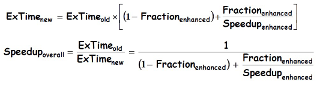
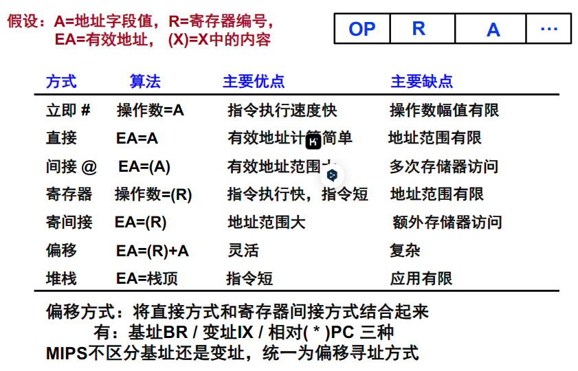

# 计算机体系结构期末复习
  

## L1-课程概要与体系结构基础
### 硬件组成与架构发展
- **不同类型计算机硬件组成**
    - **个人计算机**：以联想 ThinkCentre M8300t 台式机为例，其主机箱内包含多种 PCIe 外设插卡、内存条 DIMM、主板及内存插槽、数据线缆、中央处理器 CPU（风扇及散热片覆盖）、机械硬盘 HDD、电源模块 Power Supply、固态硬盘 SSD 及供电线缆等。这些组件协同工作，实现计算机的基本功能，如数据存储、处理和传输。
    - **高性能计算机（服务器）**：如华为 RH2285 型号机架式服务器，内部有两颗高性能 CPU（散热片覆盖）、主板、内存条 DIMM 及内存插槽、扩展板卡（PCIe FPGA）、风扇、磁盘阵列等。由于服务器需要提供高性能的计算、存储等服务，所以在稳定性、可靠性、安全性、可扩展性、可管理性等方面有较高要求，其硬件配置和架构设计都围绕这些需求展开。
    - **单板计算机（YSYX 单板计算机）**：包含 SoC 芯片、按键、选择开关、各种接口（如 FPGA JTAG 接口、外设切换开关、PL VGA、PL PS/2、PLIO 等）、晶振插座、电源模块（如电源 LDO、电源指示 LED）、烧写器切换、电平转换芯片、PS PMOD 扩展、耳机输出、音频输入、复位按键、时钟拨码开关、TF 卡插座、板载烧写器、Flash 插座、SoC UART 等众多组件。这些组件集成在一块单板上，适用于一些特定的应用场景，如嵌入式系统开发等。
- **计算机发展历程中的重要机型**
    - **ENIAC**：世界第一台电子计算机，于 1946 年诞生。它采用手动编程，通过设置开关、连接插头和插座、插拔电缆来实现程序控制。每位数值采用十进制表示，乘法运算速度为 357 次/秒，除法为 38 次/秒，有 20 个 10 位寄存器（无存储器），加法速度达 5000 次/秒。一个十进制数用 10 个电子管表示，由 40 个 9 英尺（2.74 米）高机柜组成，占地面积 167 平方米，重达 30 吨，功耗 150KW，还包含 70000 个电阻、10000 个电容、17468 个电子管、6000 个手动开关、1500 个继电器和 500 万个焊点。其设计上的不足促使了后续计算机技术的改进和发展。
    - **中国的 103 机**：中国第一台通用数字电子计算机，诞生于 1958 年。它在我国计算机发展历程中具有重要意义，标志着我国在计算机领域的起步和探索，为后续计算机技术的研究和应用奠定了基础。
    - **长城 0520C - H 台式电脑**：中国第一台国产微型计算机，于 1985 年推出，是中国计算机发展的重要里程碑，推动了计算机在国内的普及和应用。
- **冯·诺依曼结构**
    - **组成部件**：由 运算器、控制器、存储器、输入设备和输出设备五个基本部件组成。运算器负责进行算术和逻辑运算；控制器控制计算机各部件协调工作，自动执行指令；存储器用于存放数据和指令；输入设备如键盘、鼠标等用于向计算机输入信息；输出设备如显示器、打印机等用于输出计算机处理结果。
    - **工作方式**：采用“存储程序”工作方式，即将程序和数据以二进制形式存放在存储器中，计算机在运行时自动从存储器中逐条取出指令并执行。这种工作方式使得计算机的操作更加自动化和高效，成为现代计算机的基本工作原理。
    - **主要思想**：计算机内部以二进制表示指令和数据，每条指令由操作码和地址码两部分组成。操作码指出操作类型，地址码指出操作数的地址。存储器不仅能存放数据，还能存放指令，且计算机能够区分数据和指令。控制器能自动执行指令，运算器能进行加、减、乘、除等基本算术运算及一些逻辑运算和附加运算，操作人员通过输入输出设备与主机通信。

### 性能评估与定律
- **计算机硬件技术指标**
    - **机器字长**：CPU 一次能处理数据的位数，与 CPU 中的寄存器位数有关。例如，32 位 CPU 的机器字长为 32 位，它决定了计算机在一次运算中能够处理的数据量和精度，较长的机器字长通常能提高计算效率和精度，但也会增加硬件成本和复杂性。
    - **主频**：数字硬件的操作由恒定速率时钟控制，主频决定了 CPU 的时钟周期频率。例如，4.0GHz 的主频意味着 CPU 每秒可以执行 4.0×10⁹ 个时钟周期。主频越高，CPU 在单位时间内可以执行的操作次数越多，但过高的主频也可能带来散热等问题，并且主频的提升并非无限制地提高计算机性能，还受到其他因素的制约。
    - **运算速度**：包括 CPI（Cycles per Instruction，执行一条指令所需时钟周期数）、IPC（Instructions per Cycle，一个周期内执行的指令数）、MIPS（每秒执行百万条指令）和 FLOPS（每秒浮点运算次数）等指标。这些指标从不同角度衡量了计算机的运算能力，例如 MIPS 常用于衡量整数运算速度，而 FLOPS 则更侧重于浮点运算性能。在实际应用中，不同的应用场景对运算速度的不同方面有不同的需求，如科学计算更关注 FLOPS，而一般的办公应用则对 MIPS 较为敏感。
- **影响计算机及集成电路发展的定律**
    - **摩尔定律**：由 Gordon Moore 提出，集成电路上可容纳的晶体管数目约每隔两年便会增加一倍，同时成本仅有极小幅度的上升。这一定律在过去几十年间一直是计算机和集成电路行业发展的重要指导原则，促使芯片性能不断提升，推动了计算机技术的快速发展，使得计算机在体积不断缩小的同时，性能得到极大提高，如个人电脑从早期的大型机逐渐演变为如今的轻薄笔记本和小型台式机。
    - **登纳德缩放比例定律**：由 Robert H. Dennard 提出，即使在集成电路芯片上放置更多的电路，冷却问题基本不变，即功耗密度保持恒定。这一定律在集成电路设计中具有重要意义，使得芯片制造商在提高芯片集成度的同时，能够较好地控制功耗，为计算机性能的提升提供了支持。但随着技术的进一步发展，该定律在一定程度上受到了挑战，如在芯片制程进入纳米级别后，漏电等问题导致功耗难以按照该定律继续保持稳定。
    - **阿姆达尔定律**：关注系统性能提升的短板问题。它指出通过使用某种较快的执行方式所获得的性能提高，受可使用这种较快执行方式的时间所占的百分比例的限制，即通过更快的处理器来获得加速会受到慢的系统组件的制约。例如，在一个应用程序中，如果只有部分代码能够并行执行，即使增加处理器核心数量，整体性能的提升也会受到不能并行部分的限制。该定律在计算机系统设计和性能优化中具有重要指导作用，提醒设计者在提升系统性能时要综合考虑各个组件的性能平衡。
    

### 数的表示与运算
- **数的表示方法**
    - **无符号数**：寄存器的每一位均可存放数值，对于 n 位寄存器，其表示范围为[0, 2ⁿ - 1]。例如，8 位无符号数的表示范围是 0 到 255，16 位无符号数的表示范围是 0 到 65535。无符号数在一些不需要表示负数的场景中使用，如存储内存地址、计数等。
    - **有符号数**
        - **真值与机器数**：真值是带符号的数，而机器数是符号数字化的数。例如，+0.1011 和 -1100 是真值，而 0 1011 和 1 1100 是对应的机器数（这里以某种假设的表示方式为例），其中最高位为符号位，0 表示正数，1 表示负数。
        - **原码表示法**：对于整数，当 2ⁿ > x ≥ 0 时，[x]原 = 0,x；当 0 ≥ x > -2ⁿ 时，[x]原 = 2ⁿ - x。例如，x = +1110 时，[x]原 = 0,1110；x = -1110 时，[x]原 = 2⁴ + 1110 = 1,1110。原码表示法简单直观，但在进行加减运算时较为复杂，需要考虑符号位的处理。
        - **补码定义**：当 2ⁿ > x ≥ 0 时，[x]补 = 0,x；当 0 > x ≥ -2ⁿ（mod 2ⁿ + 1）时，[x]补 = 2ⁿ + 1 + x。例如，x = +1010 时，[x]补 = 0,1010；x = -1011000 时，[x]补 = 2⁷ + 1 + (-1011000) = 10000000 - 1011000 = 1,0101000。求补码的快捷方式是当真值为负时，补码可用原码除符号位外每位取反，末位加 1 求得。补码在计算机运算中具有重要作用，它使得减法运算可以转化为加法运算，简化了硬件设计。
- **算术逻辑单元（ALU）**
    - **功能与指令关系**：ALU 是指令执行的关键部分，负责执行算术和逻辑运算。在 MIPS32 指令集中，不同的指令如 lw（load word）、sw（store word）、beq（branch on equal）、slt（set on less than）等会触发 ALU 执行相应的操作，如加法、减法、逻辑与、逻辑或等。例如，执行 lw 指令时，ALU 可能需要计算内存地址，涉及加法操作；执行 beq 指令时，ALU 要进行相等比较，可能涉及减法操作并判断结果是否为 0。
    - **设计与内部结构**：以 32 位 ALU 为例，它可以由多个 1 位 ALU 组成。1 位 ALU 可以执行 AND、OR、ADD 等基本操作，通过进位链（CarryIn 和 CarryOut）连接各个 1 位 ALU 实现 32 位数据的运算。在进行减法运算时，通过对减数进行求补操作（按位取反并加 1）来实现，同时要注意区分有符号数和无符号数运算时溢出和进借位标志的处理。
    - **溢出和零检测逻辑**：对于溢出检测，在 N 位 ALU 中，Overflow = CarryIn[N - 1] XOR CarryOut[N - 1]，即当最高有效位的进位输入和进位输出不同时，表示发生了溢出。对于零检测逻辑，通过将所有输出位进行或运算后取反来判断结果是否为 0，若结果为 0，则表示运算结果为 0。这些检测逻辑在保证运算准确性和程序控制流程中起到重要作用，例如在条件分支指令中，根据运算结果是否为 0 来决定是否进行分支跳转。
    - **Slt:Set-on-less-than**：做减法，最高符号位与 Overflow 进行异或操作之后供给最低位 ALU 的 Less 输入端
    - 溢出标志 Overflow 表示有符号数加减法操作结果是否超出范围/结果的符号是否符合预期，进借位标志 CarryOut 表示无符号数加减法操作结果是否超出范围/结果能否完整地保存

### 指令系统相关
- **机器指令与指令系统概念**：机器指令是每一条机器语言的语句，而指令系统是所有机器指令的集合。指令系统处在软/硬件交界面，它既被硬件设计者用于设计计算机硬件，确保硬件能够正确执行指令；又被系统程序员看到，系统程序员需要依据指令系统编写汇编程序，并且只有熟悉计算机硬件实现才能写出高效代码。指令系统的设计好坏直接影响计算机的性能和成本，例如一个设计良好的指令系统可以提高程序的执行效率，减少指令执行的时间和硬件资源的消耗；而不合理的指令系统可能导致程序复杂、执行效率低下。
- **冯·诺依曼结构机器指令规定**：指令用二进制表示，和数据一起存放在主存中。指令由操作码和操作数（或其地址码）两部分组成，操作码定义操作类型，操作数（或其地址码）指示操作源和/或目的地。例如，在一个简单的加法指令中，操作码可能表示加法操作，操作数地址码则指定要相加的两个数在内存中的位置。这种规定使得计算机能够按照预定的程序逻辑自动执行指令，实现各种计算任务。
- **数据存储与寻址方式**
    - **数据存储顺序**：包括小端方式（Little Endian）和大端方式（Big Endian）。小端方式下，LSB（最低有效位）所在的地址是数的地址，即字地址或数的地址上存放数据的 LSB；大端方式下，MSB（最高有效位）所在的地址是数的地址，字地址或数的地址上存放数据的 MSB。例如，对于整数 -65535，在内存中存储时，若采用小端方式，其 4 个字节的存储顺序为[01 FF FF FF]（从低地址到高地址）；若采用大端方式，则存储顺序为[FF FF FF 01]。有些机器两种方式都支持，可通过特定控制位来设定采用哪种方式，如 ARM、MIPS 等。不同的数据存储顺序在数据传输和处理过程中可能会产生影响，特别是在多字节数据的处理和网络通信中需要特别注意。
    - **寻址方式**：包括立即寻址、直接寻址、间接寻址、寄存器寻址、寄间接寻址、偏移寻址、堆栈寻址等。立即寻址的操作数直接包含在指令中，执行速度快但操作数幅值有限；直接寻址的有效地址等于指令中的地址码，计算简单但地址范围有限；间接寻址通过地址码指向的内存单元获取操作数地址，地址范围大但需要多次存储器访问；寄存器寻址的操作数在寄存器中，指令执行快且指令短，但寄存器数量有限导致地址范围有限；寄间接寻址结合了寄存器和间接寻址的特点，地址范围大但需要额外的存储器访问；偏移寻址通过寄存器内容和偏移量计算有效地址，较为灵活但计算相对复杂；堆栈寻址以栈顶为有效地址，指令短但应用场景有限。这些寻址方式为程序员提供了多种访问数据的手段，在编写程序时可以根据数据的特点和程序的需求选择合适的寻址方式，以提高程序的性能和效率。
    
- **MIPS 指令系统**
    - **指令格式**：MIPS 指令长度为 32 位，有三种典型格式，即 R - type、I - type 和 J - type。R - type 格式包含 6 位操作码（op）、5 位源寄存器（rs）、5 位目标寄存器（rd）、5 位位移量（shamt）和 6 位功能码（funct），用于执行如加法（add）、减法（sub）、逻辑与（and）、逻辑或（or）、小于设置（slt）等操作；I - type 格式包含 6 位操作码、5 位源寄存器、5 位目标寄存器和 16 位立即数，用于数据传输和条件分支指令，如 lw（load word）、sw（store word）、beq（branch on equal）等；J - type 格式包含 6 位操作码和 26 位目标地址，用于无条件跳转指令。
    - **寄存器设置**：MIPS32 架构定义了 32 个 32 位通用目的寄存器（GPRs），编号从 r0 到 r31，其中 r0 硬连线为 0。还有一对特殊用途寄存器 HI 和 LO，用于保存整数乘法、除法和乘加运算的结果。此外，还有程序计数器 PC，它不是架构可见寄存器，但在指令执行过程中起到关键作用，指示下一条要执行的指令地址。这些寄存器的设置为指令的执行提供了数据存储和操作的空间，不同的寄存器在不同的指令和运算中发挥着特定的作用，合理使用寄存器可以提高程序的执行效率。 
 

## L2-复杂流水线和乱序执行(上)
### 计算机体系结构基础与简易处理器设计
- **基础回顾**：包括冯·诺依曼结构运行机理、程序计数器作用、计算机性能评估、数的表示及运算、指令系统等内容，这些构成了后续处理器设计的理论基石。
- **MIPS 寄存器与指令**：MIPS 寄存器有 zero、at、v0 - v1 等多种类型，各自具有特定功能，如 zero 恒为 0，at 为汇编程序保留等。要实现的指令涵盖算术逻辑（add、sub、and、or、slt）、控制流（beq）、存储器引用（lw、sw）等类型，且这些指令在执行过程中都需使用 ALU。
- 
### 处理器通用机制与部件详解
- **通用机制步骤**：处理器首先利用程序计数器提供指令地址，接着从内存获取指令，随后依据指令精确控制寄存器的读写以及操作的执行，这一系列步骤是处理器工作的基本流程。
- **部件功能特性**
  - **组合部件**：像与门（$Y = A \& B$）、加法器（$Y = A + B$）、多路复用器（$Y = S? I1 : I0$）、算术逻辑单元（$Y = F(A, B)$）等，其输出是输入的函数，部分组合部件的操作受时钟信号控制，在数字电路中发挥着关键作用。
  - **存储部件**：寄存器具有 N 位输入输出和写使能端，写使能信号控制数据写入，仅在时钟上升沿且写使能为 1 时更新。寄存器堆由 32 个寄存器组成，通过地址选择进行读写操作，内部通过一对多路复用器实现双读端口功能。内存有读写数据和地址总线，写操作受时钟影响，读操作在地址有效后经过短暂访问时间即可获得有效数据，类似组合逻辑。
  - 
### 单周期处理器执行与数据通路剖析
- **指令执行流程**：以 add 加法指令为例，详细展示了在单周期处理器中的执行过程，包括从程序计数器获取指令地址，从寄存器堆读取操作数，经 ALU 运算后将结果写回寄存器堆等一系列操作，涉及到程序计数器更新、寄存器读写、ALU 运算和数据存储等关键步骤。
- **各类指令通路**：分别深入介绍了 Reg - Reg 操作（如 add rd, rs, rt）、Load 操作（如 lw rt, rs, imm16）、Store 操作（如 sw rt, rs, imm16）、Branch 操作（如 beq rs, rt, imm16）和 Jump 指令的数据通路及相应控制信号。在 Branch 操作中，需读寄存器、比较操作数、计算目标地址等，控制信号由指令译码决定，如根据指令类型确定 ALU 操作、寄存器写使能、数据存储等控制信号的取值。

### 单周期处理器控制器设计方法
- **译码表构建**：根据每条指令的功能，仔细分析控制信号的取值，并系统地在指令译码表中列出。例如，对于 R - format 指令，RegDst 为 1，ALUSrc 为 0 等，通过这种方式明确不同指令与控制信号之间的对应关系。
- **逻辑表达式生成**：依据列出的指令和控制信号关系，运用逻辑推理和电路设计知识，写出每个控制信号的逻辑表达式。在 ALU 控制中，采用多层解码方式，根据 opcode 和 function code 对 ALU 操作进行解码，如 00 对应 lw、sw 的 add 操作，01 对应 beq 的 subtract 操作等，这种多层解码有助于减小主控单元规模、提高控制速度，从而优化控制器设计。

### 多周期处理器设计要点
- **设计动机与优势**：为解决单周期 CPU 因最长指令周期决定时钟周期而导致的效率问题，多周期 CPU 将指令执行分解为多个较小任务，每个任务占用一个时钟周期，不同指令所需周期数不同，且可复用功能单元，如 ALU 和内存，有效提高了硬件资源的利用率。
- **结构与控制实现**：在结构上，多周期 CPU 使用单一内存单元处理指令和数据，采用单一 ALU，并在主要功能单元后添加寄存器暂存输出结果，直到后续时钟周期使用。其控制单元通过有限状态机（FSM）实现，包括取指、译码、执行等多个状态，状态转换基于输入和当前状态，控制信号输出大多依赖当前状态（如 Moore FSM），这种设计方式能够灵活地控制指令执行流程，提高处理器的适应性和效率。

### 处理器设计步骤与资源利用分析
- **设计步骤概述**：在确定指令集架构（ISA）后，处理器设计依次经过以下关键步骤：首先用 RTL（Register Transfer Language）详细分析每条指令的功能；接着根据指令功能确定所需元件并规划时钟方案；然后将数据通路进行互连，构建起数据传输的通道；再确定每个元件所需控制信号的取值，并汇总形成指令与控制信号关系表；最后依据该表得出每个控制信号的逻辑表达式，进而设计出控制器电路。在这个过程中，涉及到数据通路和控制器的设计，数据通路包含操作元件（由组合逻辑电路实现）和存储（状态）元件（由时序逻辑电路实现），两者相互协作，共同完成处理器的功能。
- **资源利用对比**：在资源利用方面，单周期 CPU 以最长的 Load 指令执行时间确定时钟周期，当执行其他短指令时，在时钟周期后半阶段会整体处于闲置状态，造成硬件资源浪费。多周期 CPU 内部部件并非在每一拍都处于忙碌状态，存在一定的空闲时间。相比之下，流水线 CPU 旨在提高吞吐量和硬件资源利用率，但在实际应用中，由于指令执行的复杂性，难以达到理想的流水线状态，存在如指令执行阶段不均衡、资源冲突等问题，需要进一步的优化和改进。

### 流水线处理器核心知识
- **理想与实际流水线**：理想流水线的目标是在增加少量成本（主要是硬件成本）的情况下显著提高吞吐量，其特点是重复相同且独立的操作，并且这些操作可均匀划分为无资源共享的子操作。然而，在实际的指令流水线中，由于指令的多样性和复杂性，难以满足这些理想条件。实际流水线中，非流水线版本和 k - stage 流水线版本的吞吐量受寄存器延迟影响，成本随寄存器数量增加而增加，如非流水线版本的吞吐量公式为 $BW = 1 /(T + S)$（$S$为寄存器延迟），k - stage 流水线版本为 $BW_{k - stage}=1 /(T / k + S)$；成本方面，非流水线版本为 $Cost = G + R$（$R$为寄存器成本），k - stage 流水线版本为 $Cost_{k - stage}=G + Rk$。
- **设计问题与停顿原因**：流水线处理器设计面临诸多挑战，需要平衡各阶段工作，确保每个阶段的工作量和执行时间合理。同时，要妥善处理数据、控制和资源依赖问题，例如数据依赖包括 Flow 依赖（真数据依赖，即写后读 RAW）、Anti 依赖（读后写 WAR）和 Output 依赖（写后写 WAW），其中 Flow 依赖必须保证程序语义正确，而 Anti 和 Output 依赖是由于架构寄存器数量有限导致的。此外，还需处理长延迟操作和异常中断等情况。停顿是流水线运行中的常见问题，原因包括资源依赖（如寄存器文件、内存和功能单元的资源冲突）、数据依赖和控制依赖等，这些问题会导致流水线停止运行，影响处理器性能，需要通过相应的技术手段加以解决。
- **数据依赖处理策略**：针对数据依赖问题，有多种处理方法。Anti 和 Output 依赖相对较易处理，可通过在最后阶段按程序顺序写入目的地来解决。对于 Flow 依赖，有五种基本处理方式：一是检测并等待数据在寄存器文件中可用；二是在软件层面检测并消除依赖，无需硬件检测；三是检测并通过转发或旁路数据给相关指令，其核心思想是在结果产生后直接将数据送到需要的功能部件，而非经过寄存器文件，实现时需要增加依赖检查逻辑、数据转发路径和冲突检测电路来控制选通器；四是预测所需值并进行推测执行，然后验证结果；五是采用细粒度多线程技术，无需检测依赖。这些方法各有优缺点，在实际应用中需要根据具体情况选择合适的策略来优化流水线性能。
 

## L3-复杂流水线和乱序执行(中)
### （一）流水线停顿因素
在计算机体系结构中，流水线停顿是影响处理器性能的关键因素，以下对其原因进行详细讲解：
1. **资源依赖**：当计算机硬件资源（如运算单元、存储单元等）不能满足同时执行多条指令的需求时，就会出现资源依赖导致的流水线停顿。例如，在一个只有一个浮点乘法器的系统中，如果有多条浮点乘法指令连续进入流水线，后续的浮点乘法指令就必须等待前一条指令完成对浮点乘法器的使用后才能继续执行，这种等待会使流水线暂时停止流动，降低了指令执行的效率。就好像一条单车道的道路上，多辆车需要依次通过一个狭窄的路段，后面的车只能等待前面的车通过后才能前行。
2. **数据依赖**
    - **真数据相关（RAW）**：这是一种常见的数据依赖形式。例如，在指令序列中，一条加法指令 ADD R1, R2, R3（将寄存器 R2 和 R3 的值相加并存入 R1）后面跟着一条乘法指令 MUL R4, R1, R5（使用 R1 的值与 R5 相乘并存入 R4），这里乘法指令需要读取加法指令写入 R1 的结果，这种写后读的关系就是真数据相关。如果加法指令还未完成对 R1 的写入，乘法指令就不得不停顿等待，以确保读取到正确的数据，否则会导致计算错误。这就如同一个工人需要使用另一个工人刚刚生产出来的零件才能继续工作，如果零件还没准备好，工人就只能暂停。
    - **反相关（WAR）**：以如下指令序列为例，指令一为 SUB R6, R7, R8（将寄存器 R7 和 R8 的值相减并存入 R6），指令二为 AND R9, R6, R10（使用 R6 的值与 R10 进行与运算并存入 R9），这里指令二需要读取 R6 的值，而指令一在执行过程中会写入 R6。如果不进行特殊处理，当指令二先于指令一执行到读取 R6 的阶段时，就会读取到错误的数据，从而引发数据冲突，导致流水线停顿。这类似于两个人同时需要使用同一个工具，一个人正在使用时，另一个人必须等待，否则会出现问题。
    - **输出相关（WAW）**：比如有两条指令，指令一为 ADD R11, R12, R13（将寄存器 R12 和 R13 的值相加并存入 R11），指令二为 OR R11, R14, R15（使用 R14 和 R15 的值进行或运算并存入 R11），这两条指令都要向 R11 写入结果。如果不加以控制，后执行的指令可能会覆盖先执行指令写入 R11 的正确结果，导致数据错误，因此在这种情况下流水线需要停顿以保证数据的正确性。这就好像两个人同时往同一个箱子里放东西，后放的可能会把先放的东西覆盖掉。
3. **控制依赖**：在程序执行过程中，分支指令起着关键的控制作用。例如在一个 if - else 语句中，分支指令判断条件后决定程序是执行 if 分支还是 else 分支的指令。如果后续的指令依赖于这个分支的结果，那么这些指令就不能在分支指令之前执行，否则会改变程序的逻辑。而且，如果分支预测不准确，处理器可能已经预取了错误分支的指令并进入流水线，当发现分支预测错误时，就需要清空流水线中错误分支的指令，重新取正确分支的指令，这就会导致流水线停顿，严重影响处理器的性能。就像在一个岔路口，车辆必须等待交通信号灯的指示才能确定前进的方向，如果提前进入错误的道路，就需要返回重新选择，从而耽误时间。 

### （二）指令调度策略
以下是对指令调度策略第二部分内容的详细讲解：
1. **静态调度流程**
    - 编译器在静态调度中起着核心作用。它会对整个程序的指令序列进行全面分析，识别出指令之间存在的各种依赖关系，包括数据依赖和控制依赖等。例如在一个循环结构中，可能存在一些计算操作和数据加载操作。编译器会通过分析发现哪些指令之间不存在数据依赖，然后将这些数据无关的指令提前执行。比如在一个简单的数组求和循环中，有计算数组元素地址的指令和将数组元素累加到总和的指令。编译器可以先安排地址计算指令提前执行，因为它们与累加操作在数据上没有直接关联。通过这样的调整，使得相互依赖的指令在时间上间隔增大。这样做的目的是减少因指令依赖而导致的流水线停顿。然而，这种方法存在明显的局限性。编译器开发人员必须对目标流水线的结构设计有深入了解，包括有多少个功能部件、每个功能部件的执行延迟（latency）是多少等信息。因为不同的流水线结构可能对指令调度有不同的要求，如果编译器不能准确适配，就无法达到最佳的调度效果。而且，这种静态调度的通用性较差，对于每一款不同的 CPU，可能都需要开发专门的编译器。因为不同 CPU 的流水线结构、功能部件等可能存在差异。此外，一旦出现新的 CPU 型号，为了让应用程序在新 CPU 上获得较好的性能，就需要重新编译所有的应用程序，这无疑增加了软件开发和维护的成本。另外，静态调度受 cache miss 的影响很大。由于编译器在编译时无法预先知道哪一次 load 操作会导致 cache miss，所以当 cache miss 发生时，必然会导致流水线停顿，而这种停顿很难通过静态调度的方式来有效解决。
2. **动态调度机制**
    - **ID 阶段改造**：动态调度对传统的 ID（Instruction Decode，指令译码）阶段进行了重要改造，将其拆分为 Issue 和 Read operands 两个阶段。在 Issue 阶段，主要进行精简的操作，包括指令译码和资源冲突检测等基本任务。这个阶段仍然保持按序执行的特性，这是为了确保指令执行的顺序性和可预测性。但与传统的 ID 阶段不同的是，它不再对所有的数据冲突进行检测。这样做的好处是，即使指令存在一些潜在的数据冲突，只要满足其他条件，如没有资源冲突，这些指令也有机会被发射出去，进入后续的执行流程，从而提高了指令发射的灵活性。而在 Read operands 阶段，其主要职责是检测数据冲突。这个阶段是乱序执行实际发生的关键位置。当指令的操作数准备就绪时，即不存在数据冲突，该指令就可以直接投入运行，实现乱序执行，从而提高了指令执行的并行性。而对于那些操作数尚未就绪的非就绪指令，则会在这个阶段停顿，等待操作数就绪后再继续执行。例如，假设有两条指令，一条是 ADD 指令，其操作数已经在寄存器中且没有其他指令占用相关资源，那么这条 ADD 指令在经过 Issue 阶段后，在 Read operands 阶段会被判断为就绪指令，可以立即投入执行。而如果另一条 MUL 指令的操作数需要等待前一条指令的计算结果，那么在 Read operands 阶段，MUL 指令就会停顿，直到其操作数就绪。
    - **就绪指令判断**：判断一条指令是否为就绪指令的关键标准是无资源冲突且操作数就绪。以 ADD 指令为例，如果 ADD 指令所需的操作数已经存储在寄存器中，并且没有其他正在执行的指令占用与这些操作数相关的资源，比如没有其他指令正在对这些寄存器进行写操作，那么这条 ADD 指令就被认为是就绪指令，可以进入执行阶段。这种判断方式为动态调度提供了基础，使得处理器能够在运行时根据指令的实际情况灵活地调整执行顺序，充分利用硬件资源，提高指令执行的效率和并行性，减少因等待资源或数据而导致的流水线停顿。 

### （三）计分板算法运行
以下是对计分板算法运行部分内容的详细讲解：
1. **指令执行过程**
    - **Issue 阶段操作**：在这个阶段，计分板首先会检查各个功能单元的状态，判断是否有空闲的功能单元可供指令使用。同时，还会查看是否有其他指令正在写相同的目的寄存器。例如，当有一条加载指令（如 L.D）需要执行时，计分板会检查整数单元是否处于空闲状态，并且没有其他指令正在对该加载指令的目的寄存器进行写操作。如果满足这两个条件，那么这条加载指令就可以被发射到整数单元中，并同时更新计分板内部的数据结构，记录下该指令已被发射到的功能单元等相关信息。这就好比在一个工厂的生产线上，新的任务（指令）要分配到某个工作站（功能单元），需要确保该工作站有空余并且不会与其他正在进行的任务产生冲突。
    - **Read operands 检测**：计分板会持续监测指令的源操作数情况。对于每一条指令，它会检查其源操作数是否被更早的指令写入且尚未完成写入操作。比如某条指令的源操作数是 R1，如果之前有一条指令正在对 R1 进行写操作且还未结束，那么这条指令在 Read operands 阶段就会停顿，等待 R1 被正确写入后才能继续执行。这是为了确保指令读取到的操作数是正确的、最新的。可以想象成一个工人在等待另一个工人完成对某个工具（寄存器）的准备工作后才能使用这个工具进行自己的任务。
    - **Execute 与 Write result 步骤**：当指令的操作数准备就绪后，功能单元就会接收这些操作数并开始执行指令的运算操作。在功能单元完成执行后，它会通知计分板，表示该指令已经执行完毕。此时，计分板会进行 WAR（Write After Read）冲突的检查。如果不存在 WAR 冲突，那么指令就可以将结果写入到目的寄存器中。例如，一条加法指令 ADD 在执行完后，计分板会检查是否有其他指令在读取该加法指令的目的寄存器，如果没有，加法指令就可以顺利写入结果。这个过程就像生产线上的产品加工完成后，需要经过质量检查（冲突检查）才能进入下一个环节（写入结果）。
2. **算法性能局限**
    - **控制冲突处理问题**：计分板算法的一个重要局限是它不能有效地处理控制冲突。在程序执行过程中，分支指令会改变指令的执行顺序，而计分板算法无法对这种情况进行很好的应对。它的乱序执行仅仅局限在一个基本块内，无法跨越基本块进行指令的动态调度。这意味着当遇到分支指令时，计分板算法可能无法充分利用处理器的资源来提高执行效率，因为它不能提前处理分支指令后面的指令，可能会导致流水线停顿等待分支结果。例如在一个包含 if - else 结构的程序中，计分板算法可能无法在分支指令执行前就合理安排 if 和 else 分支中的指令执行顺序，从而降低了整体性能。
    - **数据冲突导致停顿**：另一个性能局限是计分板算法仍然存在 WAR 和 WAW（Write After Write）冲突导致的停顿问题。尽管它在一定程度上对数据依赖进行了管理，但对于 WAR 和 WAW 冲突，它的处理方式往往是通过停顿流水线来避免错误的发生。例如在某些情况下，当存在 WAR 冲突时，后续的指令可能会因为等待前面指令完成对寄存器的读取而停顿，即使其他资源是空闲的。这种停顿会浪费处理器的时钟周期，降低指令执行的吞吐量，影响整个系统的性能表现。 

### （四）Tomasulo 算法细节
以下是对 Tomasulo 算法细节部分内容的详细讲解：
1. **关键结构功能**
    - **保留站作用**：
        - 保留站在 Tomasulo 算法中起着至关重要的缓冲和调度作用。它负责缓存即将执行的指令以及这些指令所需的操作数。当一条指令进入保留站时，如果其操作数已经就绪，那么这些操作数就会被缓存到保留站中，等待被发送到相应的功能部件执行。例如，对于一条加法指令 ADD R1, R2, R3，当 R2 和 R3 的值已经准备好时，它们会和 ADD 指令一起被存储在保留站中。
        - 然而，如果操作数尚未就绪，保留站就会监听公共数据总线（CDB）。因为其他功能部件执行完指令后会将结果通过 CDB 广播，保留站通过监听 CDB，一旦发现自己所需的操作数在 CDB 上出现，就会获取并缓存该操作数。例如，假设另一条乘法指令 MUL R4, R5, R6 先执行，其结果要作为后续某条指令的操作数，那么这条后续指令所在的保留站就会在 CDB 上等待并获取 MUL 指令的结果。
        - 每个功能部件都有独立的保留站，这保证了不同类型的指令可以在各自的保留站中进行排队和调度。当某个功能部件的保留站已满时，新的指令就无法发射到该保留站，只能等待有空位出现，这确保了功能部件不会因接收过多指令而导致混乱。
    - **公共数据总线（CDB）**：
        - CDB 是整个系统中数据传输和共享的关键通道。它负责将功能部件执行完指令后的结果广播到所有的保留站和寄存器中。例如，当一个浮点加法功能部件完成了一条加法指令的执行并得到结果后，会通过 CDB 将这个结果发送出去。
        - 在广播结果的同时，会附带生产该结果的指令所在保留站的行号标签。这个标签非常重要，它使得接收结果的保留站和寄存器能够准确地识别该结果是否是自己所需要的。比如，某个保留站中的指令正在等待来自特定保留站的操作数，当 CDB 上出现带有相应标签的结果时，它就知道这是自己需要的操作数，可以进行接收和缓存，从而实现了数据的前送和结果的准确匹配，避免了数据传输的错误和混乱。
    - **寄存器重命名原理**：
        - 寄存器重命名是 Tomasulo 算法消除 WAR/WAW 冲突的核心机制。它通过给每个要产生的值分配一个独特的 tag，并利用重命名映射表（RAT）来维护这些 tag 和寄存器之间的关系。例如，当一条指令要向某个寄存器写入一个新值时，它会在 RAT 中为这个寄存器分配一个新的 tag，这个 tag 指向产生该值的保留站或其他数据源。
        - 当其他指令需要读取这个寄存器的值时，它们不会直接从寄存器中读取，而是通过查询 RAT 找到对应的 tag，然后根据 tag 去获取正确的值源。比如，有两条指令，指令一写寄存器 R1，指令二读寄存器 R1，在 Tomasulo 算法下，指令二会根据 RAT 找到指令一为 R1 分配的 tag，从而获取到指令一产生的正确值，而不是直接读取可能已经被指令一更新前的 R1 值，这样就有效地消除了 WAR/WAW 冲突。
2. **算法执行流程**：
    - 首先，在指令发射阶段，如果有可用的保留站，那么新的指令以及经过重命名的操作数就会被插入到保留站中。这里的重命名操作数是根据寄存器重命名机制进行处理后的操作数，确保了数据的正确来源。如果没有可用的保留站，指令就会停顿，等待保留站有空闲位置。例如，当系统中有多个指令同时到达发射阶段，而部分保留站已满时，那些无法进入保留站的指令就会处于等待状态。
    - 进入保留站后的指令会持续监听 CDB，以获取自己所需的操作数。一旦指令的所有操作数都在 CDB 上获取到并就绪，该指令就会被发送到相应的功能部件进行执行。比如，一条乘法指令在保留站中等待两个操作数，当这两个操作数分别通过 CDB 从其他功能部件的执行结果中获取到后，乘法指令就可以被发送到浮点乘法功能部件进行运算。
    - 当功能部件完成指令的执行后，会将执行结果通过 CDB 进行广播。同时，寄存器会根据 CDB 上结果附带的标签来判断是否接收该结果。如果寄存器对应的标签与 CDB 上广播结果的标签匹配，那么寄存器就会将该结果写入，完成整个指令的执行流程，实现了数据的高效传输和指令的正确执行，提高了处理器的性能和并行性。 
 

## L4-复杂流水线和乱序执行(下)
### 1. 多周期执行相关问题
在计算机体系结构中，多周期执行是一个重要的概念，它带来了一系列的特点和问题：
- **指令执行时间差异**：在多周期执行模式下，不同的指令在执行阶段所需要的时间是不一样的。例如整数加法（Integer add）和整数乘法（Integer mul）、浮点乘法（FP mul）以及加载/存储（Load/store）等指令，它们在执行时可能会因为操作的复杂程度不同而花费不同的时钟周期数。这是由于不同的运算逻辑和硬件实现方式导致的，像浮点乘法通常比整数加法更为复杂，所以其执行周期可能更长。
- **对指令顺序语义的影响**：这种执行方式虽然允许独立的指令在之前长延迟指令完成之前就在不同的功能单元开始执行，这在一定程度上提高了处理器的并行性和效率。但是，它却破坏了指令集架构（ISA）的顺序语义。因为按照 ISA 的设计初衷，指令是应该按照程序编写的顺序依次执行并产生相应结果的。而多周期执行可能导致指令的执行顺序与程序顺序不一致，从而引发一些潜在的问题。
- **异常处理的复杂性**：在多周期执行过程中，异常处理变得更加复杂。异常被定义为程序执行过程中 CPU 遇到的特殊情况，分为内部“异常”和外部“中断”。内部“异常”如硬故障中断（像电源掉电、硬件线路故障等）和程序性中断（如算术溢出、缺页、越界、越权、非法指令、除数为 0、堆栈溢出、访问超时、断点设置、单步、系统调用等），这些异常是在 CPU 内部发生的。外部“中断”则是在 CPU 外部发生的特殊事件，通过“中断请求”信号向 CPU 请求处理，如实时钟、控制台、打印机缺纸、外设准备好、采样计时到、DMA 传输结束等。乱序执行容易引发不精确异常，即异常产生时的处理器状态与指令按严格程序顺序执行时不完全相同。这是因为流水线可能已经完成了程序顺序比引起异常的指令靠后的指令，或者还未完成程序顺序比引起异常的指令靠前的指令。
- **保证精确异常的方法**：为了确保精确异常，有两种主要的思路。一种是使每个操作都花费相同的时间，这样可以保证指令的执行顺序和异常处理都能符合 ISA 的顺序语义。然而，这种方法的缺点是会增加指令的延迟，因为所有指令都要按照最长执行时间的指令来进行同步。例如，如果有一个非常耗时的操作，那么其他原本可以快速执行的指令也不得不等待相同的时间，这就降低了整体的执行效率。另一种方法是采用一些辅助技术，如历史缓冲区、未来寄存器文件、检查点等。历史缓冲区可以记录指令的执行历史信息，以便在异常发生时能够恢复到正确的状态；未来寄存器文件可以提前保存一些可能会被后续指令使用的数据，避免因为异常而丢失；检查点则是在特定的执行点保存处理器的状态，当出现异常时可以快速回滚到检查点状态进行处理。

### 2. 重排序缓冲（ROB）
重排序缓冲（ROB）在计算机体系结构中起着关键作用：
- **指令重排序与状态更新机制**
    - ROB 允许在指令提交前进行重排序，这是提升处理器性能的重要手段。在指令执行过程中，当指令完成执行时，会先更新寄存器别名表（RAT），RAT 可看作是前端寄存器文件，用于记录指令执行过程中的寄存器映射关系，确保指令间数据的正确传递和操作。而只有当指令退休时，也就是成为机器中最老且已完成执行的指令时，才会更新架构寄存器文件，这样就保证了架构状态始终按照程序顺序进行精确更新，避免因乱序执行导致的状态不一致问题。例如，在执行一系列指令时，可能有多条指令同时处于执行阶段，但它们完成的先后顺序可能与程序顺序不同，ROB 确保了最终对架构寄存器文件的更新是有序的，符合程序的逻辑顺序。
- **ROB 记录信息的全面性**
    - ROB 记录了丰富的信息，这些信息对于指令的正确执行和异常处理至关重要。它包含目标寄存器 ID 和值，这有助于确定指令的操作结果应该存储到哪个寄存器以及具体的值是多少；目标存储器地址和值，用于处理与存储器相关的操作，如加载和存储指令；指令 PC，方便在需要时回溯指令的执行位置；寄存器/数据有效位，用于判断数据是否已经准备好，避免使用未就绪的数据进行操作；控制位，控制指令的执行流程和相关操作；异常标志位，能够及时标记指令执行过程中是否出现异常情况。例如，在执行一条加法指令时，ROB 会记录目标寄存器（假设为 R1）的 ID，以及计算得到的结果值，同时设置相应的有效位表示结果已就绪，若在执行过程中发生溢出等异常，异常标志位会被置位，后续处理流程可以根据这些信息进行相应操作。
- **操作原则的重要性**
    - ROB 的操作遵循按序分发/执行、乱序完成、按序退休原则。按序分发/执行确保了指令按照程序顺序进入执行阶段，维持了程序的基本逻辑顺序。乱序完成则利用了处理器的并行性，允许指令在不影响最终结果的前提下，根据资源可用性和执行时间的不同，以乱序的方式完成执行，提高了执行效率。而按序退休是保证架构状态精确性的关键环节，它使得指令对架构寄存器文件和内存的更新是按照程序顺序进行的，避免了因乱序更新可能带来的错误。例如，在一个循环结构中，多条指令可能在不同的时钟周期内完成执行，但只有最老的指令按照顺序退休并更新架构状态，这样就保证了循环执行过程中数据的一致性和正确性。

### 3. 寄存器重命名
在计算机体系结构中，寄存器重命名是提升处理器性能的关键技术之一，以下是对这部分内容的详细讲解：
- **Tomasulo 算法的局限性**
    - Tomasulo 算法在数据传输和硬件结构方面存在明显的性能局限。在数据总线方面，由于大量的数据需要在公共数据总线上进行传输，例如运算结果、寄存器数据等，这导致了数据总线传输量过大。过多的数据传输会占用大量的总线带宽，使得数据传输的延迟增加，进而影响整个处理器的运行效率。同时，该算法中使用的多路复用器和长总线也会对时钟频率产生负面影响。多路复用器需要在多个输入数据中进行选择并输出，其复杂的逻辑操作会增加信号传输的延迟。长总线则会导致信号传输的时间变长，并且容易受到干扰，这些因素综合起来会降低处理器的时钟频率，限制了处理器的性能提升。
- **物理寄存器文件的应用**
    - 为了克服 Tomasulo 算法的局限性，采用了物理寄存器文件的方法。这种方法首先消除了原有的架构寄存器文件，因为架构寄存器文件在某些情况下可能会限制寄存器的灵活使用。然后添加了更大的物理寄存器文件，其容量远大于架构寄存器文件（例如可能从原来的 32 个架构寄存器扩展到数量远大于 32 的物理寄存器，如 P0 - Pn，n >> 32）。通过修改重命名表来建立架构寄存器与物理寄存器之间的映射关系，使得指令在执行过程中能够将目标寄存器重命名为物理寄存器。例如，一条指令原本要将结果写入架构寄存器 R1，经过重命名后会写入到对应的物理寄存器 Pi。同时，引入空闲列表来管理未分配的物理寄存器，当有新的指令需要寄存器资源时，可以从空闲列表中获取可用的物理寄存器进行分配。如果在执行过程中出现物理寄存器不足的情况，处理器可能会暂停流水线操作，等待有可用的物理寄存器后再继续执行。
- **寄存器重命名的实现方式**
    - 寄存器重命名可以通过两种方式实现，即缓冲标签和物理寄存器。在使用物理寄存器进行重命名时，指令的目标寄存器会被重命名为物理寄存器，并且在同一架构寄存器的下一次写操作提交之前，该物理寄存器不会被重新分配，只有当这次写操作完成提交后，才可以被重用。例如，对于一系列操作指令，如果第一条指令将结果写入物理寄存器 P1 并对应架构寄存器 R1，在后续的指令中，如果还有对 R1 的写操作未完成提交，那么 P1 就不会被分配给其他指令使用，直到该写操作完成。这种重用机制保证了数据的一致性和正确性，同时也提高了寄存器资源的利用率，减少了不必要的寄存器分配和释放操作，进一步提升了处理器的性能。 

### 4. 分支预测
在计算机体系结构中，分支预测是优化流水线处理器性能的关键环节，以下是对这部分内容的详细讲解：
- **分支指令带来的问题**：在流水线处理器的运行过程中，控制流指令（分支指令）的出现频率相当高，大约占所有指令的 15 - 25%。由于分支指令的执行结果会改变程序的执行流程，所以在流水线中确定其下一条取指地址时会存在明显的延迟。在传统的流水线操作中，需要等待分支指令执行完成并确定跳转方向后，才能明确下一条要取指的指令地址。而这个等待过程会导致流水线出现停顿，降低处理器的执行效率。如果发生分支预测错误，那么之前已经在流水线中预取和部分执行的指令都将作废，会造成大量的指令槽被浪费，严重影响处理器的性能。例如，在一个循环结构中，如果分支预测错误，可能会导致整个循环体的指令都需要重新取指和执行，极大地增加了执行时间。
- **处理控制依赖的方法**
    - **消除控制流指令**：谓词合并是将复杂的谓词条件转换为更简单的形式，通过将多个相关的条件判断合并为一个，减少分支指令的数量。例如，对于条件“(a == b) && (c   5000)”，原本可能需要三条分支指令分别判断每个条件，通过谓词合并可以将其转换为一个综合的条件判断，只使用一条分支指令。谓词执行则是将控制依赖转换为数据依赖，编译器为每个指令设置一个谓词位，只有当谓词位为真时指令才会被执行，否则相当于执行一条空操作（NOP）指令，从而避免了分支指令的使用。
    - **分支预测**：这是一种通过猜测分支指令的执行结果来提前确定下一条取指地址的方法。在取指阶段就对分支指令的行为进行预测，包括分支是否会被执行（即分支方向）以及如果被执行，其目标地址是多少。如果预测准确，流水线可以继续流畅运行，避免停顿；如果预测错误，则需要进行回滚和重新取指等操作，但相比于不进行预测，仍然有可能提高整体性能。
    - **延迟分支**：在这种方法中，将分支指令后面的一条或多条指令放置在分支延迟槽中，无论分支是否跳转，这些延迟槽中的指令都会被执行。这样可以利用分支延迟的时间来执行一些有用的操作，减少因分支等待而造成的性能损失。例如，在一些简单的循环结构中，可以将循环体中的部分不依赖于分支结果的指令放置在延迟槽中，提高流水线的利用率。
    - **细粒度多线程**：通过在处理器中同时运行多个线程，当一个线程因为分支等待或其他原因停顿下来时，可以切换到其他就绪的线程继续执行，从而提高处理器的整体利用率。这种方法需要硬件对多线程的支持，包括线程切换机制、寄存器保存和恢复等功能。
    - **多路执行**：如果能够提前确定分支的多个可能路径的地址，处理器可以同时从多个可能的路径取指并执行指令，当分支结果确定后，再选择正确的执行路径继续执行，丢弃错误路径的执行结果。这种方法需要较多的硬件资源来支持多个路径的取指和执行，但在某些情况下可以显著提高性能。
- **分支预测的分类**
    - **简单预测**：总是预测下一条顺序指令是一种简单直接的预测方法。它假设程序大多数情况下是顺序执行的，所以直接将下一条取指地址预测为当前 PC + 4（假设指令长度为 4 字节）。这种方法在一些简单的程序中可能有一定的效果，但对于含有较多分支且分支行为复杂的程序，预测准确率较低。
    - **增强预测**：在取指阶段需要预测三个关键信息，即分支方向、是否为分支指令以及分支目标地址。分支目标缓冲器（BTB）在这个过程中起到了重要作用。BTB 的结构类似于 cache，它使用当前 PC 的低 k 位作为索引，取出一个表项，然后进行精确匹配，从而得到预测的 PC。通过保存之前分支指令的相关信息，BTB 可以快速提供分支目标地址的预测，帮助处理器提前确定取指方向。
- **分支方向预测的类型**
    - **静态预测**
      - **总是不 taken 和总是 taken**：总是不 taken 策略实现简单，不需要额外的硬件支持如 BTB 和方向预测，但对于条件分支的预测准确率较低，大约在 30 - 40%。而总是 taken 策略不需要进行方向预测，对于一些常见的如向后的分支（通常在循环结构中，目标地址低于分支 PC）有较好的预测效果，准确率约为 60 - 70%。
      - **BTFN（Backward taken, forward not taken）**：这种策略根据分支的方向特点进行预测，将向后的分支（通常是循环分支）预测为 taken，其他分支预测为 not taken，利用了循环结构中分支的常见行为模式。
      - **基于 profile 和基于程序分析**：基于 profile 的方法是编译器通过运行程序的一个样本，收集分支的执行情况信息，然后根据这些信息确定每个分支的可能执行方向，并将其编码为分支指令格式中的一个提示位。其准确性依赖于样本的代表性，如果样本能够很好地反映程序的实际运行情况，预测准确率会较高，但如果样本不具有代表性，准确率可能会很低。基于程序分析的方法则是利用一些启发式规则，例如根据操作码的特点（如预测 BLEZ 为 NT，因为在很多程序中负整数常被用作错误值）、循环结构的特点（预测保护循环执行的分支为 taken）以及指针和浮点比较的常见结果（预测不相等）等来确定分支的静态预测方向。这种方法不需要运行样本，但启发式规则可能并不适用于所有程序，需要编译器进行深入的分析并且依赖于指令集架构（ISA）的支持。
    - **动态预测**
      - **上次预测**：每个分支使用一个单比特来记录上次执行的方向，当下次遇到该分支时，直接根据这个比特的值进行预测。这种方法在循环结构中对于较大的循环次数（K）有较高的准确率，例如对于一个有 K 次迭代的循环，准确率为 (K - 2)/K，但对于循环次数较小的循环，准确率可能很低，甚至在某些情况下会总是预测错误（如循环只有 2 次迭代时）。
      - **基于 2 位计数器**：为每个分支关联一个 2 位计数器（存储在 BTB 中），相比单比特，多出来的一位提供了一定的滞后性。当分支连续两次执行结果相同时，才会改变预测结果，这样可以避免因为偶尔的一次不同结果而频繁改变预测方向，提高了预测的稳定性和准确性。例如，对于一个循环，其准确率可以达到 (K - 1)/K（假设计数器初始化为弱 taken），对于一些常见的分支行为模式有更好的预测效果，但需要更多的硬件资源来存储和更新这些计数器。
      - **两级预测**：包括全局分支相关和局部分支相关两种实现方式。全局分支相关是利用最近执行的其他分支的结果来预测当前分支的方向，例如，如果前一个分支未执行，那么下一个相关分支也很可能未执行。通过使用全局历史寄存器（GHR）来记录所有分支的执行历史，并使用这个历史信息作为索引来查找一个模式历史表（PHT），PHT 中存储了每个历史模式下分支的执行结果，从而进行预测。局部分支相关则是为每个分支设置一个独立的历史寄存器，记录该分支自身的执行历史，根据这个历史来预测分支的方向，同样使用 PHT 来存储和查找历史结果。这种两级预测方法结合了全局和局部的信息，能够更好地适应不同分支的行为特点，提高预测准确率。
      - **混合预测**：将多种不同的预测方法结合起来，根据不同的情况选择最合适的预测策略。例如，在某些情况下使用静态预测方法，在其他情况下使用动态预测方法，或者根据不同类型的分支选择不同的预测器。通过这种方式，可以综合利用各种预测方法的优势，进一步提高预测的准确性。
      - **基于神经网络**：利用神经网络的强大学习能力来进行分支预测，如感知机分支预测器。这种方法能够学习到复杂的分支行为模式，具有较高的预测精度，但需要更多的计算资源来进行神经网络的训练和推理，并且在硬件实现上也较为复杂。目前已经在一些处理器如 AMD Piledriver、AMD Ryzen 中得到应用。
- **其他相关预测器**
    - **锦标赛预测器**：考虑到不同分支指令与其他分支指令的相关性不同，有些分支使用全局历史进行预测效果好，而有些则使用局部历史预测更好。锦标赛预测器设置了两个预测器，一个基于全局历史，一个基于局部历史，同时还有一个选择器。选择器根据一定的规则（通常使用 PC 作为索引的一个小的预测器）来决定对于当前分支指令应该采用哪个预测器的结果。通过这种方式，锦标赛预测器能够在不同的分支情况下选择最合适的预测策略，从而获得较好的性能。在实际的性能测试中，锦标赛预测器通常比其他单一的预测器表现更好。
    - **BTB 和 BHT 结合**：在取指（IF）阶段，同时利用当前 PC 检索分支历史表（BHT）和分支目标缓冲器（BTB），但以 BHT 的结果为主。如果 BHT 预测分支跳转，并且 BTB 命中，则使用 BTB 中的预测 PC；如果 BTB 未命中，则会停顿等待。如果 BHT 预测不跳转，则直接使用 PC + 4 作为下一条取指地址（以 BHT 的预测为准）。BTB 和 BHT 的更新是在相应分支指令 commit 时进行，这样可以保证预测信息的准确性和及时性。
    - **返回地址预测器**：过程调用返回指令大约占所有分支指令的 15%左右，其特殊性在于每次返回的目标地址可能不同。直接使用 BTB 对返回地址进行预测效果不理想（准确率  

## L5-缓存
### 内存层次结构
- **理想与现实的矛盾**：理想内存应具备零访问时间、无限容量、零成本、无限带宽等特性，但在实际中，这些要求相互制约。例如，随着内存容量增大，其访问速度会变慢；更快的内存技术往往成本更高，更高的带宽也需要更多的资源投入。如 SRAM 速度快但成本高，DRAM 容量大但速度相对较慢，硬盘容量虽大但访问时间长达约 10 毫秒。
- **层次结构的构建原理**：为解决上述矛盾，采用了内存层次结构。它基于数据的局部性原理，将存储分为多个层级，越靠近处理器的层级速度越快但容量越小，越远离处理器的层级速度越慢但容量越大。常见的层次结构包括寄存器、L1 缓存、L2 缓存、L3 缓存、主存（DRAM）和磁盘等。这种结构使得处理器能快速访问常用数据，同时利用大容量的存储设备保存更多数据，在速度和容量之间取得平衡。

### 缓存原理
- **局部性原理的应用**
    - **时间局部性**：程序在执行过程中，近期访问过的数据很可能在不久的将来再次被访问。例如，在循环结构中，循环变量和相关数据会被频繁重复使用，利用这一特性，可将最近访问的数据存储在缓存中，以减少对慢速内存的访问。
    - **空间局部性**：当访问某个内存地址时，其附近的内存地址数据也有较大概率被访问。比如，在数组遍历或顺序指令执行时，相邻的数据通常会被连续访问。基于此，缓存会存储与最近访问地址相邻的数据块，进一步提高数据访问效率。
- **缓存的管理方式**：分为手动和自动管理。手动管理需要程序员负责数据在不同层级之间的移动，这在大型程序中对程序员来说过于复杂，仅在一些嵌入式处理器（如片上暂存器 SRAM）和 GPU（共享内存）中使用。自动管理则由硬件负责数据的移动，对程序员透明，大大简化了编程工作，现代处理器大多采用这种方式。

### 缓存操作与设计要点
- **缓存的基本结构与访问**
    - **缓存块与地址映射**：内存被逻辑划分为固定大小的缓存块，每个块映射到缓存中的特定位置。在直接映射缓存中，一个内存块只能映射到缓存的一个特定位置，通过地址中的索引位确定。例如，对于给定的字节地址，可根据其索引位在缓存的标签存储和数据存储中进行定位，并检查标签是否匹配以确定是否命中。
    - **标签阵列与数据存储**：标签阵列用于存储与缓存块对应的标签信息，数据存储则保存实际的数据内容。在访问缓存时，需同时对标签和数据进行操作，通过比较地址中的标签与标签阵列中的值来判断是否命中。增加块大小可减少标签阵列的大小和因空间局部性导致的缺失，但可能会增加冲突缺失；提高关联性（如从直接映射到组相联）可减少冲突缺失，但会使硬件更复杂、访问速度变慢且标签存储增大。
- **缓存缺失类型及处理**
    - **缺失类型**：强制缺失是指数据首次被访问时必然不在缓存中；容量缺失发生在程序访问的数据量超过缓存容量时，即使是全相联缓存也会出现；冲突缺失是由于多个数据映射到缓存的同一位置而产生的，例如在直接映射缓存中，不同地址但索引相同的数据会竞争同一缓存位置。
    - **处理策略**：为减少缺失率，可采用多种方法。如增大缓存和块大小、提高关联性等，但这些方法都需要在性能和成本之间进行权衡。此外，还可以使用受害者缓存（将被替换的数据暂存，在一定程度上增加关联性）、更好的替换策略（如伪 LRU、NRU、DRRIP 等）、预取数据以及缓存压缩等技术。
- **写策略与缓存一致性**
    - **写回与写直达**：写回策略是在缓存块被替换时才将修改后的数据写回下一级存储，这样可以节省缓存层级之间的带宽并减少能量消耗，但需要在标签存储中设置脏位来标记数据是否被修改；写直达策略则是在写入缓存的同时立即更新下一级存储，虽然实现简单且能保证各级数据一致性，但会占用更多带宽且无法合并写操作。
    - **写分配与不分配**：写分配策略在写缺失时将包含要写地址的整个缓存块从内存读入缓存后再进行写操作，便于合并写操作且使写缺失处理与读缺失类似，但需要传输整个缓存块；不分配策略则直接将数据写回内存，在写操作局部性低时可节省缓存空间。
- **指令与数据缓存**：在缓存设计中，需要考虑指令缓存和数据缓存是分开还是统一。统一缓存可动态共享空间，但可能导致指令和数据相互干扰，且由于指令和数据在流水线中的访问位置不同，会影响访问速度。因此，大多数处理器的一级缓存通常是分开的，而高级缓存则多采用统一设计。

### 缓存性能优化
- **多级别缓存设计**：在流水线设计中，一级缓存受限于周期时间，通常较小且关联性较低，其标签存储和数据存储采用并行访问方式；二级缓存则需要在命中率和访问延迟之间平衡，一般较大且关联性较高，标签存储和数据存储多为串行访问。一级缓存作为过滤器，减少了对二级缓存的不必要访问，各级缓存的管理策略也因此有所不同。
- **性能提升的关键指标与方法**
    - **关键指标**：缓存性能与缓存大小、块大小、关联性、替换策略、插入/放置策略等密切相关。通过调整这些参数，可以优化缓存性能。
    - **提升方法**：减少缺失率可通过增加关联性、采用更好的替换策略、利用软件辅助等方式，但要注意避免因替换重要数据而降低性能；减少缺失延迟或成本可采用多级缓存、关键字优先、子块划分、非阻塞缓存、多周期访问等技术；降低命中延迟或成本同样对整体性能提升有重要作用。在实际应用中，需要综合考虑这些因素，根据具体的工作负载和系统需求来优化缓存设计。 
 

## L6-大缓存、虚拟内存
### 缓存替换策略
- **常见策略及原理**：在缓存缺失时，替换策略起着关键作用。随机（Random）策略简单地随机选择一个缓存块进行替换；先进先出（FIFO）则按照缓存块进入缓存的先后顺序进行替换；最近最少使用（LRU）策略旨在替换最长时间未被使用的块，但实现难度较大。例如，在一个 4 路缓存中，如果对不同数据块的访问顺序无规律，随机策略可能有一定优势；而在数据访问具有一定局部性的情况下，LRU 理论上能更好地保持常用数据在缓存中，但实际实现时需要复杂的硬件逻辑来跟踪块的使用顺序。
- **LRU 近似策略**：由于在高关联性缓存中实现真正的 LRU 成本高昂，现代处理器常采用近似策略。如 NRU（Not Most Recently Used）为每个块设置一个位，块被访问时该位清零，当所有位都为零时全部置一，淘汰位为 1 的块；DRRIP 使用多个 NRU 位（如 3 位），新块设置为高位使其更接近被淘汰，类似于将新块放置在 LRU 列表头部附近而非尾部。这些近似策略在一定程度上平衡了性能和硬件复杂度。
- **策略比较与选择**：LRU 和随机策略在不同场景下表现各异。以 4 路缓存且存在对 A、B、C、D、E 的循环引用为例，LRU 策略可能因无法准确预测数据的使用频率而导致 0%命中率，而当出现缓存颠簸（Set thrashing，即程序工作集大于组相联度）时，随机替换策略可能避免陷入局部最优的困境。在实际应用中，两者平均命中率相似，因此通常需根据具体的工作负载来选择，或采用两者的混合策略，并通过设置采样来动态决定何时使用哪种策略，以达到更好的性能平衡。

### 缓存写策略
- **写回与写直达**：写回（Write - back）策略在缓存块被淘汰时才将修改后的数据写回下一级存储，这种方式能够节省缓存层级之间的带宽，因为在缓存块未被替换期间，多次对同一缓存块的写操作可以合并，只需在淘汰时进行一次回写，同时也节省了能量。但为了标记缓存块是否被修改，需要在标签存储中设置脏位（Dirty bit）。例如，在一个频繁进行数据更新的程序中，如果大部分数据在缓存中被多次修改后才被替换，写回策略能显著减少内存写入操作。写直达（Write - through）策略则在 CPU 向缓存写入数据的同时，立即向内存进行更新，其优点是实现简单，并且能够保证各级存储数据的一致性，因为所有层级的数据始终保持同步。然而，这种方式会占用更多的带宽，因为每次写操作都需要同时更新缓存和内存，且无法利用写合并的优化，在对带宽敏感的系统中可能会成为性能瓶颈。
- **写分配与不分配**：默认情况下，在写缺失时采用写分配（Allocate on write miss）策略，即先将包含要写地址的整个缓存块从内存读入缓存，然后再进行写操作。这样做的好处是可以将后续对该缓存块的写操作合并，并且使写缺失的处理方式与读缺失类似，简化了控制逻辑。但缺点是需要传输整个缓存块，可能会带来较大的延迟和带宽消耗。例如，在一些对内存带宽要求较高的应用中，频繁的写分配操作可能会影响系统性能。与之相反，不分配（No - allocate）策略则直接将数据写回内存，在写操作的局部性较低时，这种策略可以节省缓存空间，因为不需要将不常使用的写数据所在的缓存块读入缓存，从而有可能提高缓存的整体命中率。
- **子块缓存**：为了解决对整个缓存块进行写入时的效率问题，引入了子块缓存（Subblocked Caches）的概念。其原理是将一个缓存块划分为多个子块（或扇区），每个子块都有独立的有效位（Valid bit）和脏位（Dirty bit）。在进行写操作时，只需要对相关的子块进行操作，而无需传输整个缓存块，从而减少了不必要的内存传输。例如，对于一个 64 字节的缓存块，如果只需要修改其中的 4 字节数据，采用子块缓存可以仅对这 4 字节所在的子块进行操作，避免了将整个 64 字节块读入和写出缓存。然而，这种设计也带来了一些问题，如增加了硬件设计的复杂性，并且在某些情况下可能无法充分利用空间局部性，因为数据可能被分散存储在不同的子块中，降低了缓存块整体被利用的概率。

### 指令与数据缓存设计
- **分开与统一的利弊**：指令缓存和数据缓存的设计可以选择分开或统一的方式。统一缓存的优点在于能够动态共享缓存空间，避免了静态分区（如分开的指令缓存和数据缓存）可能导致的空间浪费问题，即不会出现某个缓存因专门用于存储指令或数据而在另一种数据需求增加时出现空间闲置的情况。但是，统一缓存也存在明显的缺点，指令和数据可能会相互干扰，因为它们在流水线中的访问位置和频率通常不同，如果两者竞争缓存资源，可能会导致缓存命中率下降，进而影响性能。例如，在一些数据密集型的程序中，数据缓存的需求较大，如果采用统一缓存，可能会将指令挤出缓存，导致指令获取延迟增加。此外，由于指令和数据在流水线中的不同阶段被访问，如何放置统一缓存以实现快速访问也是一个需要解决的问题。这也是大多数处理器在一级缓存中通常选择将指令缓存和数据缓存分开的主要原因。
- **各级缓存的设计特点**：在流水线设计中，一级缓存（包括指令和数据缓存）受到周期时间的严格限制。为了满足快速访问的需求，一级缓存通常较小且关联性较低，这样可以减少访问延迟。同时，其标签存储和数据存储采用并行访问的方式，以进一步提高访问速度。例如，在一些高性能处理器的一级缓存设计中，通过减少缓存块大小和关联性，能够在一个时钟周期内完成缓存访问操作。而二级缓存的设计则需要在命中率和访问延迟之间进行平衡。通常情况下，二级缓存较大且具有较高的关联性，以提高缓存的命中率，但相应地，其访问延迟相对一级缓存会有所增加，因此标签存储和数据存储采用串行访问方式。这种设计使得二级缓存能够在不影响处理器整体性能的前提下，存储更多的数据并减少缓存缺失的概率。此外，一级缓存作为数据访问的第一道过滤器，能够过滤掉一些具有时间和空间局部性的数据访问请求，减少对二级缓存的访问压力，因此各级缓存的管理策略也会有所不同，以适应其在缓存层次结构中的角色和功能。

### 多核缓存问题
- **多核系统中的缓存重要性**：在多核/多线程系统中，缓存效率的重要性愈发凸显。由于多个核心同时运行多个线程，对内存带宽的需求大幅增加，而内存带宽是一种有限的资源。同时，缓存空间在跨核心/线程的情况下也成为了一种稀缺资源，如何合理分配和利用缓存空间直接影响系统的整体性能。例如，在一个多核心服务器中，多个线程同时处理不同的任务，如果缓存不能有效地为每个核心提供所需的数据，可能会导致大量的缓存缺失，进而频繁地访问内存，增加内存带宽的压力，降低系统的性能。
- **共享与私有缓存的特点**：私有缓存是指只属于一个核心的缓存，虽然一个共享块可能会存在于多个私有缓存中，但每个核心对其私有缓存具有独占访问权。这种设计的优点是可以减少核心之间的竞争，因为每个核心都有自己独立的缓存空间，例如在一些对缓存延迟要求极高的实时应用中，私有缓存能够确保核心快速获取所需数据，而不会受到其他核心的干扰。共享缓存则由多个核心共同使用，其优势在于能够动态地在核心之间分配缓存空间，避免了因数据重复存储在多个私有缓存中而造成的空间浪费，并且在缓存一致性维护方面可能具有一定的优势，因为当一个核心修改了共享缓存中的数据后，其他核心能够更快地感知到数据的变化。例如，在一些多线程协同工作的场景中，多个线程可能会频繁访问相同的数据，如果使用共享缓存，可以减少数据的冗余存储，并提高数据的共享效率。然而，共享缓存也存在一些问题，如访问速度相对较慢，因为缓存需要与多个核心进行通信和协调，而且当多个核心同时访问共享缓存时，容易产生冲突缺失，即一个核心的访问可能会影响其他核心的缓存命中率，导致某些核心的性能下降。例如，在一个多核心处理器中，如果多个核心同时对共享缓存中的同一个数据块进行读写操作，可能会导致缓存冲突，增加缓存缺失的概率，从而降低系统性能。
- **非均匀缓存架构（NUCA）**：对于大型的多兆字节缓存，采用统一的缓存访问方式（即无论数据在缓存中的位置如何，访问延迟都是恒定的）会导致成本过高，因为为了保证最坏情况下的访问延迟，需要在硬件设计上投入大量资源。因此，引入了非均匀缓存架构（NUCA）。在 NUCA 中，需要解决一系列问题，如数据的映射（如何将数据合理地分布在缓存的不同位置）、迁移（当数据的访问频率发生变化时，如何将其迁移到更合适的位置）、搜索（如何快速定位到所需的数据）和复制（在哪些情况下需要对数据进行复制以提高访问效率）等。例如，在一个共享 NUCA 缓存的设计中，缓存由多个部分组成，包括核心、L1 缓存和共享 L2 缓存的一部分，缓存控制器负责将地址请求转发到适当的 L2 缓存 bank，并处理缓存一致性操作，以确保数据的正确性和一致性。

### 虚拟内存原理与实现
- **引入虚拟内存的原因**：在计算机系统中，物理内存的容量是有限的，这在许多情况下会成为限制系统性能和功能的瓶颈。例如，在早期的计算机系统或一些嵌入式系统中，物理内存的大小可能无法满足日益增长的程序和数据的存储需求。此外，在多进程环境下，物理内存的管理变得更加复杂。程序员需要管理物理内存空间，这不仅不方便，而且在处理多个进程时难度会大幅增加，包括难以支持代码和数据的重定位（因为地址在程序中是直接指定的，如果需要将程序或数据移动到不同的物理内存位置，需要手动修改大量的地址引用）、多个进程之间的保护和隔离（确保一个进程不会意外地访问或修改另一个进程的内存空间）以及数据/代码的共享（在多个进程之间高效地共享数据和代码）等问题。为了解决这些问题，虚拟内存应运而生。虚拟内存通过硬件和软件的协同工作，为程序员提供了一个看似无限大的地址空间的假象，使得程序员无需关注物理内存的实际大小和管理细节，从而大大简化了编程工作。
- **基本机制与地址转换**：在虚拟内存系统中，程序中每条指令生成的地址都是一个“虚拟地址”，它与直接用于访问主内存的物理地址不同。例如，在 x86 架构中，虚拟地址也被称为“线性地址”。系统通过一个“地址翻译”机制将虚拟地址映射到物理地址，在 x86 中，物理地址又被称为“实地址”。这个地址翻译过程可以由硬件和软件共同实现。具体来说，虚拟地址空间被划分为多个页（Page），物理地址空间被划分为多个物理帧（Frame），页表（Page Table）则是存储虚拟页到物理帧映射关系的关键数据结构。当程序访问内存时，硬件首先会检查所需的虚拟页是否在物理内存中，如果在，则通过页表找到对应的物理帧，并将虚拟地址转换为物理地址进行访问；如果不在物理内存中，而是存储在磁盘上，则触发需求分页（Demand Paging）机制，虚拟内存系统会将该页从磁盘读入物理内存中的一个空闲物理帧，并更新页表中的映射关系，然后再进行访问。例如，在一个简单的页式虚拟内存系统中，硬件通过操作系统管理的页表进行地址转换，确保程序能够正确地访问到所需的数据，而无需程序员了解数据在物理内存中的实际位置。
- **页表相关细节**：页表是虚拟内存系统中的核心组成部分，它在某种程度上可以看作是物理内存数据存储的“标签存储”。每个虚拟页在页表中都有对应的页表条目（Page Table Entry，PTE），PTE 包含了多个重要信息。首先，有一个有效位（Valid bit）用于指示该虚拟页是否位于物理内存中，如果有效位为 0，则表示该页不在内存中，此时访问该页会触发页面错误（Page Fault）。其次，PTE 中包含物理页号（Physical Page Number），用于确定虚拟页在物理内存中的具体位置。此外，还可能包含一些用于支持替换策略的位（如在缓存替换中类似的信息，用于决定当物理内存不足时，应该替换哪个页面）、脏位（Dirty bit）用于支持“写回缓存”（在缓存写回策略中，当页面被修改时，脏位会被设置，以便在页面被替换时决定是否需要将修改后的数据写回磁盘）以及保护位（Protection bits）用于实现访问控制和保护，确保不同进程只能访问其被授权的内存区域。例如，在一个 64 位系统中，如果页表条目为 4 字节，对于一个具有大量虚拟页的进程，页表可能会占用相当大的内存空间，这就引出了页表管理的一系列问题。

### 虚拟内存的硬件支持与挑战
- **TLB（Translation Lookaside Buffer）的作用与原理**：TLB 是一种专门用于缓存页表条目（PTEs）的硬件结构，其目的是为了加速地址转换过程。由于页表访问具有较大的时间局部性，即程序在一段时间内通常会频繁访问相同的页面，因此将最近使用的 PTEs 缓存在 TLB 中可以显著减少内存访问次数。例如，在大多数情况下，对于指令获取和数据访存操作，通过 TLB 可以将原本需要两次内存访问（一次访问页表获取物理地址，一次使用物理地址访问数据）减少到仅需一次。TLB 通常较小，能够在大约 1 个周期内被访问，并且具有较高的关联性，以提高命中率。其大小一般在 16 - 512 条目之间，在典型的工作负载下，命中率可达到 95 - 99%。TLB 的索引通常由 VPN（虚拟页号）的低位确定，标签由未使用的 VPN 位和进程 ID 组成，数据则是对应的页表条目。例如，在一个简单的 TLB 示例中，当处理器发送虚拟地址进行地址转换时，首先会根据 VPN 的低位在 TLB 中查找匹配的条目，如果命中，则直接获取对应的物理地址，避免了访问页表的开销；如果未命中，则需要进行页表遍历以获取 PTE，并可能将其插入到 TLB 中。
- **TLB 缺失与页面错误处理**：由于 TLB 容量有限，不可避免地会出现 TLB 缺失的情况。当 TLB 缺失发生时，硬件或软件需要采取相应的措施来处理。在硬件管理的 TLB 缺失处理中（如 x86 架构），硬件会自动进行页表遍历（Walking the page directory/table），从内存中获取相应的 PTE，并将其插入到 TLB 中。如果 TLB 已满，则会替换其中的一个条目，这个过程对系统软件是透明的。而在软件管理的 TLB 缺失处理中（如 MIPS 架构），硬件会触发一个异常，操作系统会接管处理过程，进行页表遍历以获取 PTE，并负责在 TLB 中插入或淘汰条目。页面错误（Page Fault）则是在访问不在物理内存中的虚拟页时发生，此时页表条目会指示该虚拟页不在内存中，访问该页会触发页面错误异常，操作系统的陷阱处理程序会被调用，将数据从磁盘读入物理内存，并更新页表中的相应条目。在这个过程中，其他进程可以继续执行，操作系统对页面的放置具有完全的控制权。例如，在一个多任务系统中，当一个进程发生页面错误时，操作系统可以暂停该进程，将所需页面从磁盘调入内存，然后恢复该进程的执行，而不会影响其他进程的正常运行。
- **缓存与虚拟内存交互问题及解决方法**：在虚拟内存系统中，缓存与地址转换之间存在密切的关系，其中一个关键问题是缓存是虚拟寻址还是物理寻址。如果缓存是虚拟寻址，可能会出现别名问题（Aliasing problem），即不同的虚拟地址可能映射到同一个物理地址，或者同一个虚拟地址在不同进程中可能映射到不同的物理地址。例如，在不同进程中，由于虚拟地址空间是独立的，可能会出现相同的虚拟地址被分配给不同的物理内存区域，或者不同的虚拟地址指向同一个物理内存位置的情况。当缓存存在时，这可能会导致数据不一致的问题，因为缓存中可能会存在同一个物理地址的多个副本。为了解决这个问题，可以采取一些措施，如限制缓存大小为（页面大小乘以关联度），这样可以确保缓存索引仅来自页面偏移（因为在这种情况下，虚拟地址和物理地址的页面偏移是相同的
 

## L7-虚拟内存、主存系统、缓存一致性
### 虚拟内存
- **页表挑战与应对策略**：在虚拟内存系统中，页表的大小可能成为一个显著问题。以 64 位虚拟地址和 40 位物理地址的系统为例，若简单计算，页表可能会占用高达 2^52 个条目，每个条目约 4 字节，这对于内存空间来说是一个巨大的负担，且一个进程通常并不会使用整个虚拟内存空间。为了解决这一问题，采用了多级页表的技术。多级页表通过将页表进行分层，使得在内存中只需存储当前正在使用的部分页表，从而大大减少了页表在内存中的占用空间。例如，在实际应用中，操作系统可以根据进程的内存访问情况，动态地加载和卸载不同层级的页表，提高内存的利用效率。
- **TLB（Translation Lookaside Buffer）的原理与操作**：TLB 是虚拟内存系统中的一个关键硬件结构，其主要作用是缓存页表条目（PTEs），以加速地址转换过程。由于程序在运行过程中，对内存的访问往往具有一定的时间局部性，即近期访问过的页面在未来一段时间内仍有较大概率被再次访问，TLB 正是利用了这一特性。它通常是一个较小的缓存，大小一般在 16 - 512 条目之间，能够在大约 1 个周期内被快速访问，且具有较高的关联性，这使得它在大多数情况下能够实现较高的命中率（通常 > 95 - 99%）。在进行地址转换时，TLB 根据虚拟页号（VPN）的低位作为索引进行查找。其标签由未使用的 VPN 位和进程 ID 组成，数据则是对应的页表条目。当 TLB 命中时，可以直接获取物理地址，避免了访问内存中的页表，从而大大提高了地址转换的速度。然而，由于 TLB 容量有限，当发生 TLB 缺失时，就需要进行额外的处理。在硬件管理的 TLB 缺失处理方式（如 x86 架构）中，硬件会自动进行页表遍历（Walking the page directory/table），从内存中读取相应的 PTE，并将其插入到 TLB 中。如果此时 TLB 已满，则会根据一定的替换策略替换其中的一个条目，这个过程对系统软件是透明的。而在软件管理的 TLB 缺失处理方式（如 MIPS 架构）中，硬件会触发一个异常，操作系统会接管处理过程，进行页表遍历以获取 PTE，并负责在 TLB 中插入或淘汰条目。
- **TLB 与缓存的关系及别名问题解决**：TLB 和缓存之间存在着密切的关系，其中一个重要的问题是缓存的寻址方式，即缓存是虚拟寻址还是物理寻址。如果缓存是虚拟寻址，可能会出现别名问题（Aliasing problem）。例如，不同的虚拟地址可能映射到同一个物理地址，或者同一个虚拟地址在不同进程中可能映射到不同的物理地址。当缓存存在时，这可能会导致数据不一致的问题，因为缓存中可能会存在同一个物理地址的多个副本。为了解决这个问题，可以采取一些措施。一种方法是限制缓存大小为（页面大小乘以关联度），这样可以确保缓存索引仅来自页面偏移（因为在这种情况下，虚拟地址和物理地址的页面偏移是相同的），从而减少别名问题的发生。另一种方法是在操作系统中进行页面放置的限制，例如采用页面着色（Page coloring）技术，确保索引（VA）= 索引（PA），这种方法在许多 SPARC 处理器中得到应用。此外，在写入缓存块时，需要搜索所有可能包含相同物理块的索引，并对其进行更新或失效操作，以保证数据的一致性。
- **虚拟内存的支持与操作细节**：虚拟内存的实现需要硬件和软件的协同工作。硬件方面，内存管理单元（MMU）起着核心作用，它包括页表基寄存器（Page Table Base Register）、TLB、页表遍历器等组件。软件则负责一系列关键操作，如填充页表，根据程序的内存需求和分配情况，将虚拟页与物理页的映射关系记录在页表中；在物理内存中决定页面的替换策略，当物理内存已满且需要加载新页面时，选择合适的页面进行替换；在进程切换时，更改页表寄存器，确保新运行的线程能够使用正确的页表；以及处理页面错误，当访问不在物理内存中的页面时，操作系统的陷阱处理程序会被调用，将数据从磁盘读入物理内存，并更新页表中的相应条目。页表条目中包含了多个重要信息，有效位用于指示该虚拟页是否位于物理内存中，如果有效位为 0，则表示该页不在内存中，此时访问该页会触发页面错误（Page Fault）；物理页号（Physical Page Number）用于确定虚拟页在物理内存中的具体位置；替换策略位用于支持在页面替换时的决策；脏位（Dirty bit）用于支持“写回缓存”，当页面在缓存中被修改时，脏位会被设置，以便在页面被替换时决定是否需要将修改后的数据写回磁盘；保护位（Protection bits）用于实现访问控制和保护，确保不同进程只能访问其被授权的内存区域。在地址转换过程中，如果发生页面命中，处理器首先会将虚拟地址发送给 MMU，MMU 根据虚拟地址中的 VPN 查找 TLB，如果 TLB 命中，则直接获取对应的物理地址，并将其发送给 L1 缓存，L1 缓存再将数据发送给处理器。如果 TLB 未命中，则按照上述 TLB 缺失的处理方式进行操作。若发生页面错误，MMU 会触发页面错误异常，操作系统的页面错误处理程序会识别出需要替换的页面（即受害者页面，如果该页面被修改，则需要将其写回磁盘），然后将新页面从磁盘读入物理内存，并更新页表中的 PTE，最后返回原进程并重新执行触发错误的指令。

### 内存技术与存储组织
- **DRAM 与 SRAM 的特性对比**：DRAM（动态随机存取存储器）是现代计算机主存的主要存储技术。它通过电容的电荷状态来存储数据，每个存储单元由一个电容和一个访问晶体管组成。电容的充电或放电状态分别表示存储的数据为 1 或 0。然而，由于电容会通过 RC 路径漏电，导致 DRAM 单元会随着时间逐渐失去电荷，因此 DRAM 需要定期进行刷新操作，以维持数据的正确性。这一特性使得 DRAM 的访问速度相对较慢，因为在进行读写操作之前，可能需要先进行刷新操作。同时，DRAM 的制造工艺要求将电容和逻辑电路集成在一起，这也增加了制造的难度和成本。但 DRAM 的优势在于其具有较高的存储密度，能够在较小的芯片面积上存储更多的数据，并且成本相对较低。相比之下，SRAM（静态随机存取存储器）使用两个交叉耦合的反相器来存储一个位的数据，其反馈路径使得存储的值能够在“单元”中保持稳定。SRAM 的存储单元需要 4 个晶体管进行存储，2 个晶体管进行访问。由于不需要进行刷新操作，SRAM 的访问速度比 DRAM 快得多。但是，其存储密度较低，每个存储单元需要更多的晶体管，导致芯片面积较大，成本也相对较高。在实际应用中，SRAM 通常用于高速缓存等对速度要求较高但对容量要求相对较低的场景，而 DRAM 则作为主存，提供较大的存储容量。
- **存储组织架构的层次与原理**：主存系统的存储组织具有一定的层次结构，主要由 DIMM（双列直插式内存模块）、Rank（内存组）、Bank（内存库）、阵列等组成。DIMM 是一种印刷电路板，其正面和背面安装有 DRAM 芯片，是内存的物理载体。一个 DIMM 可以包含多个 Rank，一个 Rank 是由多个 DRAM 芯片组成的集合，这些芯片协同工作以响应内存请求，并保持数据总线的满载。例如，对于一个 64 位数据总线，可能需要 8 个 8 位的 DRAM 芯片或 4 个 16 位的 DRAM 芯片来组成一个 Rank。一个 Rank 又可以进一步划分为多个 Bank，Bank 是在一次内存请求中处于忙碌状态的 Rank 的子集。每个 Bank 由多个阵列（如子阵列、瓦片、矩阵等）组成，为了提高存储密度，阵列通常会设计得较大，这导致行缓冲器（Row Buffer）也会相应变宽。例如，在一些情况下，对于一个 64B 的请求，可能会读取 8KB 的行缓冲器数据，这种现象被称为过度取数（overfetch）。行缓冲器在 DRAM 中起着类似于缓存的作用，当发生行缓冲器命中时，数据访问时间约为 20ns（只需将数据从行缓冲器移动到引脚）；当行缓冲器为空时，访问时间约为 40ns（需要先从阵列中读取数据，然后再移动到引脚）；而当发生行缓冲器冲突时，访问时间约为 60ns（需要先预充电位线，然后读取新行，最后将数据移动到引脚）。此外，还需要考虑到在队列中的等待时间（通常为几十纳秒）以及地址/命令/数据传输延迟（约 10ns）。为了提高内存的性能和容量，还采用了一些技术，如内存交错（Interleaving）技术。其原理是将一个大的内存阵列划分为多个可以独立访问的 Bank，这样可以减少内存阵列的访问延迟，并支持并行访问。例如，在一个内存系统中，如果内存被划分为多个 Bank，且这些 Bank 可以独立访问，它们共享地址和数据总线，那么在每个周期内可以启动和完成一个 Bank 的访问。如果所有的访问请求都指向不同的 Bank，则可以实现 N 个并发访问，从而大大提高内存的带宽和并行性。
- **内存控制器的相关策略与操作**：内存控制器在内存系统中起着至关重要的作用，它负责管理内存的各种操作，并采用了一系列策略来优化性能。在页面策略方面，有开放/关闭页面策略。如果一个访问流具有局部性，即程序在一段时间内频繁访问同一行的数据，那么内存控制器会保持行缓冲器开放，采用开放页面策略。在这种情况下，行缓冲器命中的成本较低，因为数据可以直接从行缓冲器中获取。然而，如果访问流的局部性较差，几乎每个访问都可能导致行缓冲器未命中，此时内存控制器会在访问后立即预充电位线，采用关闭页面策略，以减少不必要的等待时间。在读写操作方面，由于通常使用单一总线进行读写操作，当在读写之间切换时，总线方向必须反转，这会消耗时间并导致总线空闲。为了避免这种情况，写操作通常会以突发方式进行，通过写缓冲器来存储待写的数据，直到达到一个高水位标记时才进行实际的写入操作，然后在达到低水位标记时将写缓冲器中的数据排空。在地址映射策略方面，为了提高内存的性能，可以采用不同的地址映射方式。例如，可以将连续的缓存行放置在同一行中，以提高行缓冲器的命中率；或者将连续的缓存行放置在不同的 Rank 中，以提高内存的并行性。常见的地址映射策略包括 row:rank:bank:channel:column:blkoffset 或 row:column:rank:bank:channel:blkoffset 等形式。在调度策略方面，有多种不同的算法可供选择。FCFS（First Come First Served）策略按照请求的先后顺序发出第一个准备好的读或写请求；First Ready - FCFS 策略则优先发出行缓冲器命中的请求，如果有可用的行缓冲器命中请求；Stall Time Fair 策略会优先发出行缓冲器命中的请求，除非这样做会导致其他线程被忽视，这种策略在一定程度上兼顾了公平性和效率。此外，由于 DRAM 单元需要定期刷新，内存控制器需要负责发出刷新命令。每 64ms 内，每个 DRAM 单元都必须被刷新一次，通常情况下，内存控制器平均每 7.8us 会发出一次刷新命令。在刷新期间，内存系统会暂时不可用，因为刷新操作需要占用一定的时间和资源。

### 缓存一致性
- **基本概念与重要性**：在多处理器系统中，缓存一致性是确保系统正确运行和数据一致性的关键因素。对于共享内存的多处理器系统，如对称多处理器（SMP）系统，多个处理器都可以访问同一个主存空间。在这种情况下，当一个处理器对某个数据进行写操作后，其他处理器在读取该数据时应该能够获取到最新的值，这就要求系统满足写传播（Write propagation）和写序列化（Write serialization）的要求。写传播确保一个处理器的写操作能够在足够的时间后被其他处理器看到，而写序列化则保证所有处理器看到的对同一位置的两个写操作的顺序是一致的。缓存一致性协议就是用来定义和实现这些要求的规则和机制，它规定了处理器操作的可见性和顺序性，从而保证系统的正确性和稳定性。如果缓存一致性得不到保证，可能会导致数据不一致、程序错误甚至系统崩溃等严重问题。例如，在一个多处理器系统中，如果两个处理器同时对同一个共享变量进行写操作，但由于缓存不一致，它们可能会在各自的缓存中保存不同的值，这将导致后续的计算结果出现错误，影响整个系统的运行。
- **一致性协议类型与原理**：主要有两种常见的缓存一致性协议类型，即基于目录（Directory - based）和监听（Snooping）协议。基于目录的协议通过在系统中设置一个或多个目录来记录内存块的共享状态。这些目录可以分布在整个系统中，与相应的内存区域相对应。当一个处理器对某个内存块进行操作时，它会首先查询目录以获取该内存块的共享状态信息，然后根据这些信息进行相应的操作。例如，如果一个处理器要对一个处于共享状态的内存块进行写操作，目录会通知其他持有该内存块副本的处理器使它们的副本无效，从而保证只有一个处理器能够拥有该内存块的独占访问权，实现写无效（Write - invalidate）的操作。监听协议则采用了一种不同的方式，它为每个缓存块附带了共享状态信息，并且所有的缓存控制器都会监听共享总线。当一个处理器对某个缓存块进行操作时，它会在总线上发出相应的信号，其他缓存控制器通过监听总线信号来检测是否与自己缓存中的块相关，并根据需要更新自己缓存块的共享状态。例如，在写更新（Write - update）操作中，当一个处理器对一个处于共享状态的缓存块进行写操作时，它会在总线上发送更新信号，其他持有该缓存块共享副本的处理器会接收到信号并更新自己的副本，从而保持数据的一致性。在实际应用中，不同的系统可能会根据自身的需求和特点选择不同的缓存一致性协议，或者对协议进行一定的改进和优化。
- **示例与设计问题分析**：以 SMP 系统为例，详细展示了缓存一致性协议的具体操作过程。假设在一个 SMP 系统中有三个处理器 P1、P2 和 P3，以及它们各自的缓存和共享主存。当 P1 读取变量 X 时，如果 X 不在其缓存中（即读缺失），它会向总线发送请求，主存接收到请求后会将 X 的值发送给 P1，并将 X 的副本放置在 P1 的缓存中，此时缓存块状态为共享（Shared）。当 P2 也读取 X 时，同样会发生读缺失，经过总线请求和主存响应后，X 的副本也会被放置在 P2 的缓存中，此时 X 在 P1 和 P2 的缓存中均为共享状态。当 P1 对 X 进行写操作时，由于其缓存中的 X 处于共享状态，它会向总线发送请求，P2 的缓存控制器监听到这个请求后，会将自己缓存中的 X 副本标记为无效（Invalid），同时 P1 的缓存中 X 的状态会转换为修改（Modified）。如果此时 P2 再次读取 X，由于其缓存中的 X 已无效，它会再次向总线发送请求，P1 监听到这个请求后，会将自己缓存中的 X 降级为共享状态，并将数据发送给 P2，同时主存也会更新 X 的值。在这个过程中，涉及到了多个关键的设计问题。例如，在数据无效化（Invalidate）过程中，需要快速准确地找到持有共享副本的缓存，并发送无效化消息；在写回/写直达（Writeback/writethrough）策略选择上，需要考虑数据的一致性和带宽的利用效率；在缓存块状态管理方面，需要明确不同状态之间的转换条件和操作；在标签竞争（Contention for tags）问题上，需要设计合理的机制来避免多个处理器同时访问同一标签导致的冲突；在写序列化（Enforcing write serialization）方面，需要确保所有处理器对同一位置的写操作顺序的一致性。这些设计问题需要综合考虑系统的性能、成本和复杂性等因素，通过合理的设计和优化来解决。 
 

## L8-缓存一致性、内存一致性
该文档围绕计算机体系结构中的缓存一致性、内存一致性、多线程编程模型及相关同步机制等核心主题展开了深入讲解，具体内容如下：

### 缓存一致性
- **多处理器内存组织架构**：在多处理器系统中，内存组织主要分为集中式共享内存多处理器（SMP）和分布式内存多处理器。SMP 系统的特点是多个处理器连接到单一的集中式内存，由于所有处理器面对相同的内存组织形式，因此具有统一内存访问（UMA）的特性，即每个处理器访问内存的延迟相对一致。这种架构下，共享内存使得所有处理器都能够访问整个内存地址空间，但随着处理器数量增加或缓存数据量增大，集中式内存可能会成为带宽瓶颈。不过，如果系统配备了大容量缓存且处理器数量较少（少于十几个），这种带宽瓶颈问题通常可以得到缓解。例如，在一些小型的服务器系统中，采用 SMP 架构能够在一定程度上满足多处理器对内存的访问需求，同时保持较好的性能。而分布式内存多处理器则是将内存分布在各个处理器节点中，以提高系统的可扩展性。当一个处理器能够直接访问另一个处理器的本地内存时，其地址空间是共享的，这种系统被称为分布式共享内存（DSM）多处理器；若各个处理器的内存严格本地独立，处理器之间需要通过消息传递来通信数据，此时系统就演变成了计算机集群或多计算机系统，并且由于本地内存访问延迟低于远程内存，这种架构具有非统一内存访问（NUMA）的特性。在大规模数据处理或高性能计算场景中，分布式内存多处理器的优势更为明显，能够更好地利用多处理器的并行计算能力。
- **缓存一致性协议详解**：缓存一致性协议是确保多处理器系统中缓存数据一致性的关键机制，主要分为基于目录（Directory - based）和监听（Snooping）两种类型。基于目录的协议通过在系统中设置一个或多个目录来记录内存块的共享状态信息。这些目录通常与对应的内存区域分布在一起，每个目录负责跟踪一部分内存块的共享情况。当处理器对某个内存块进行操作时，首先会查询相应的目录以获取该内存块的共享状态，然后根据状态信息进行后续操作。例如，如果一个处理器要对一个处于共享状态的内存块进行写操作，目录会通知其他持有该内存块副本的处理器，使其副本无效，从而保证该处理器在写操作前获得该内存块的独占访问权，这就是写无效（Write - invalidate）策略。监听协议则采用了不同的方式，它为每个缓存块都附带了共享状态信息，并且所有的缓存控制器都会监听共享总线。当一个处理器对某个缓存块进行操作时，会在总线上发出相应的信号，其他缓存控制器通过监听总线信号来检测是否与自己缓存中的块相关，并根据需要更新自己缓存块的共享状态。例如，在写更新（Write - update）操作中，当一个处理器对一个处于共享状态的缓存块进行写操作时，它会在总线上发送更新信号，其他持有该缓存块共享副本的处理器会接收到信号并更新自己的副本，从而保持数据的一致性。以一个 SMP 系统的实际操作为例，当处理器 P1 读取变量 X 时，如果 X 不在其缓存中（即读缺失），P1 会向总线发送请求，主存接收到请求后会将 X 的值发送给 P1，并将 X 的副本放置在 P1 的缓存中，此时缓存块状态为共享（Shared）。接着，当处理器 P2 也读取 X 时，同样会发生读缺失，经过总线请求和主存响应后，X 的副本也会被放置在 P2 的缓存中，此时 X 在 P1 和 P2 的缓存中均为共享状态。当 P1 对 X 进行写操作时，由于其缓存中的 X 处于共享状态，它会向总线发送请求，P2 的缓存控制器监听到这个请求后，会将自己缓存中的 X 副本标记为无效（Invalid），同时 P1 的缓存中 X 的状态会转换为修改（Modified）。如果此时 P2 再次读取 X，由于其缓存中的 X 已无效，它会再次向总线发送请求，P1 监听到这个请求后，会将自己缓存中的 X 降级为共享状态，并将数据发送给 P2，同时主存也会更新 X 的值。在缓存一致性协议的设计过程中，还需要考虑诸多关键问题，如数据无效化（Invalidate）过程中，如何快速准确地找到持有共享副本的缓存，并发送无效化消息；在写回/写直达（Writeback/writethrough）策略选择上，需要权衡数据的一致性和带宽的利用效率；在缓存块状态管理方面，要明确不同状态之间的转换条件和操作；在标签竞争（Contention for tags）问题上，需要设计合理的机制来避免多个处理器同时访问同一标签导致的冲突；在写序列化（Enforcing write serialization）方面，要确保所有处理器对同一位置的写操作顺序的一致性。这些问题的解决需要综合考虑系统的性能、成本和复杂性等多方面因素，通过精心的设计和优化来实现。

### 多线程编程模型与同步
- **共享内存与消息传递模型对比**：共享内存编程模型是一种被广泛理解和应用的编程模型，其主要特点是通信过程相对隐式，程序员无需显式地处理数据传输的细节，硬件会自动处理数据的保护和缓存控制等操作。例如，在一个多线程的应用程序中，不同线程可以通过共享内存中的变量进行数据交互，这种方式在一定程度上简化了编程的复杂性。然而，正是由于缓存一致性的存在，使得共享内存编程在实现过程中面临一些挑战，如需要确保多个处理器对共享数据的缓存一致性，这增加了系统的复杂性和硬件设计的难度。相比之下，消息传递编程模型则不存在缓存一致性的问题，其硬件设计相对简单。在这种模型中，通信是显式的，程序员需要明确地发送和接收消息来进行数据传输，这使得程序员能够更灵活地对代码进行重构和优化。例如，在分布式系统中，不同节点之间通过消息传递来交换数据，程序员可以根据系统的需求和网络状况，合理地设计消息的格式和传输方式，从而提高系统的性能和可靠性。以 Ocean Kernel 程序为例，展示了共享内存编程的具体应用场景，在该程序中，多个线程通过共享内存中的数组进行数据计算和更新，体现了共享内存编程模型在处理大规模数据计算时的优势和特点。同时，文档还分别给出了共享地址空间模型和消息传递模型的代码示例，进一步说明了两种编程模型在实现方式上的差异。在共享地址空间模型中，通过锁和屏障等同步机制来保证多个线程对共享数据的正确访问和更新；而在消息传递模型中，线程之间通过发送和接收消息来传递数据，避免了共享数据带来的一致性问题。
- **同步机制的实现与优化**：在多线程编程中，同步机制是确保程序正确性和数据一致性的关键。由于应用程序中存在一些关键阶段，这些阶段必须原子执行，即不能被其他并行进程中断或干扰，否则可能会导致数据错误或程序异常。为了实现这一目标，通常会使用锁机制来保证在同一时间只有一个程序能够进入临界区，访问和修改共享数据。硬件为了支持锁机制，提供了一些基本的原语，其中最常用的是原子读 - 修改 - 写操作，如原子交换（Atomic exchange）和测试与设置（Test & set）等。原子交换操作可以交换寄存器和内存中的内容，而测试与设置操作则是将内存位置的值传输到寄存器中，并将内存位置设置为 1。以一个简单的锁实现为例，通过测试与设置寄存器和内存位置的值，并结合条件分支指令，可以构建一个基本的锁机制。例如，使用“lock: t&s register, location bnz register, lock CS st location, #0”的指令序列，首先尝试通过测试与设置操作获取锁，如果寄存器的值不为 0，则表示锁已被其他进程占用，当前进程继续自旋等待；如果寄存器的值为 0，则表示成功获取锁，进入临界区执行代码，执行完毕后将锁释放（将内存位置设置为 0）。在实际应用中，锁通常可以被缓存，这有助于减少总线流量和提高系统性能。当一个处理器获取锁并将其状态设置为独占（Exclusive）时，它可以在本地缓存中对锁进行更新，而其他处理器在访问锁时会首先检查本地缓存，只有在本地缓存中没有找到锁或者锁的状态发生变化时才会访问内存或总线。这样可以避免频繁的总线操作，提高系统的并行性。例如，在自旋锁（Spin lock）的实现中，一个进程为了获取锁可能会进入一个无限循环，不断尝试进行读 - 修改操作，直到成功获取锁。如果锁在内存中，这种频繁的访问会导致大量的总线流量，严重影响系统性能。通过缓存锁，可以使进程在本地缓存上自旋等待，大大减少了对总线的访问，提高了系统的效率。此外，还介绍了一些改进的同步机制，如测试 - 测试 - 设置（Test - and - Test - and - Set）、加载链接和存储条件（Load - Linked and Store Conditional，LL - SC）等。LL - SC 是一种具有较高灵活性的原子读 - 修改 - 写实现方式，它通过在读取数据时更新一个表示已读的表，并在存储数据时检查该表，确保只有在没有其他进程干扰的情况下才能成功存储。这种方式在某些情况下比测试 - 测试 - 设置更高效，因为如果存储条件失败，不会产生总线流量。例如，在一个多处理器系统中，多个进程可能会同时竞争一个共享资源，使用 LL - SC 机制可以有效地减少总线冲突，提高系统的性能。同时，为了进一步减少带宽需求，还提出了一些其他的锁机制，如 Ticket 锁、基于数组的锁和排队锁等。Ticket 锁的工作原理是每个到达的进程原子地获取一个票号，并递增票号计数器，然后进程不断检查当前正在服务的票号，当轮到自己时才能进入临界区，完成操作后递增正在服务的票号。这种方式保证了公平性，并且由于每个进程只需要关注自己的票号，减少了对共享资源的竞争，从而降低了带宽需求。基于数组的锁则是使用一个数组来代替单个的“正在服务”变量，每个进程在不同的数组元素上等待，这种方式进一步提高了公平性和可扩展性，但需要更多的存储空间。排队锁通过目录控制器来跟踪请求的到达顺序，当锁可用时，按照顺序将锁传递给下一个等待的进程，只有一个进程会看到锁的无效化和更新，从而减少了总线流量和冲突。

### 内存一致性模型
- **一致性与连贯性的差异与联系**：在计算机体系结构中，缓存连贯性（Cache coherence）和内存一致性（Memory consistency）是两个密切相关但又有所不同的概念。缓存连贯性主要关注的是在多处理器系统中，当一个处理器对某个数据进行写操作后，其他处理器是否能够最终看到这个写操作的结果，以及所有处理器对同一位置的写操作是否按照相同的顺序被观察到，即满足写传播（Write propagation）和写序列化（Write serialization）的要求。例如，在一个 SMP 系统中，如果处理器 P1 对变量 X 进行了写操作，经过一段时间后，处理器 P2 读取 X 时应该能够获取到 P1 写入的值，并且无论其他处理器的操作顺序如何，所有处理器都应该看到相同的写操作顺序。而内存一致性模型则更侧重于定义不同内存位置的读写操作之间的顺序关系，它规定了硬件应该保证的一致性模型，程序员在编写程序时需要基于这些假设来确保程序的正确性。例如，在顺序一致性（Sequential consistency）模型中，假设在一个程序内，指令的执行顺序是按照程序编写的顺序保留的，每个指令都原子执行，并且不同线程的指令可以任意交错执行。这意味着程序员可以按照单线程的思维方式来编写多线程程序，但在实际硬件实现中，可能会因为一些优化措施（如写缓冲区、乱序执行或缓存一致性协议中的 ACK 丢失等）而破坏这种顺序一致性，导致程序出现意外的结果。例如，在一个简单的多线程程序中，初始时变量 A 和 B 都为 0，线程 P1 执行“A = 1; if (B == 0) critical section”，线程 P2 执行“B = 1; if (A == 0) critical section”。在顺序一致性模型下，如果 P1 先执行 A = 1，然后 P2 执行 B = 1，那么 P1 和 P2 都不会进入临界区。但如果硬件采用了乱序执行或其他优化策略，可能会导致 P1 和 P2 同时进入临界区，这就违反了程序的预期行为。因此，内存一致性模型为程序员提供了一种了解硬件重排序能力的方式，帮助程序员编写更可靠的多线程程序。
- **放松一致性模型与栅栏指令的作用**：由于顺序一致性模型在某些情况下可能会限制硬件的优化空间，从而影响系统的性能，因此引入了放松一致性模型（Relaxed consistency models）。这种模型的核心思想是在保证程序正确性的前提下，根据程序的不同部分对数据一致性的需求，有针对性地放松一些顺序一致性的约束。在实际应用中，程序员通常只关心程序中部分关键区域（如存在数据竞争的区域）的一致性，而对于其他不存在数据竞争的区域，可以允许一定程度的重排序和优化。为了实现这种放松一致性的控制，引入了栅栏指令（Fence instructions）。栅栏指令是一种特殊的指令，它要求在执行该指令之前的所有内存访问操作都必须完成后，才能继续执行后续的操作。例如，在一个多线程程序中，可能存在一些代码区域对数据一致性要求较高，而另一些区域则相对较低。程序员可以在关键区域之前和之后插入栅栏指令，确保在这些区域内的操作按照顺序执行，而在其他区域则可以利用硬件的优化能力提高性能。例如，在一个生产者 - 消费者模型的程序中，生产者线程在向共享缓冲区写入数据后，插入一个栅栏指令，确保数据已经正确写入内存，然后消费者线程在读取数据之前也插入一个栅栏指令，保证读取的数据是最新的。这样，在其他非关键区域，硬件可以根据自身的优化策略对指令进行重排序，提高系统的整体性能，同时又保证了关键区域的数据一致性。

### 事务内存
- **事务内存的原理与优势**：事务内存是一种旨在简化多线程编程的新范式，它为程序员提供了一种更方便、高效的方式来处理共享数据的并发访问问题。与传统的锁机制不同，事务内存使用事务开始（transaction begin）和事务结束（transaction end）的方式来封装需要原子执行的代码段，取代了繁琐的锁 - 解锁操作。在事务执行过程中，事务具有推测性执行的特点，即它假设在执行过程中不会发生冲突，尽可能地并行执行代码，只有在检测到冲突时才会进行回滚和重试。这种方式能够有效地提高程序的性能，并且由于避免了传统锁机制中可能出现的死锁问题，使得程序的正确性更容易保证。例如，在一个生产者 - 消费者关系的应用场景中，使用事务内存可以大大简化代码的编写和维护。生产者在向工作队列的尾部添加任务时，可以将相关操作封装在一个事务中，如“Enqueue transaction begin if (tail = NULL) update head and tail else update tail transaction end”；消费者从队列头部获取任务时也可以类似地封装在一个事务中，如“Dequeue transaction begin if(head->next == NULL) update head and tail else update head transaction end”。在这种情况下，如果使用传统的锁机制，由于生产者和消费者可能同时对队列的头部和尾部进行操作，容易导致死锁，而事务内存则可以有效地避免这种情况的发生，并且能够让生产者和消费者在一定程度上并行执行，提高系统的吞吐量。此外，事务内存还为程序员提供了更大的灵活性，程序员可以自由地将需要原子执行的代码段封装在事务中，而无需过多担心对性能和正确性的影响，硬件会自动处理事务的原子性和一致性问题，为程序员提供了一种更高级的抽象编程模型。
- **事务内存的实现与设计考虑**：在事务内存的实现过程中，缓存起着关键的作用。缓存需要跟踪每个事务的读集（Read - set）和写集（Write - set），读集记录了事务在执行过程中读取的所有内存位置，写集则记录了事务写入的内存位置。在事务执行期间，写操作并不会立即更新到内存中，而是在事务结束时才使写操作可见。当一个事务准备提交时，它会广播自己的写集，如果其他事务的读集与该写集有交集，则可能会导致冲突，此时相关事务需要进行回滚（abort）操作。例如，在一个多处理器系统中，多个事务可能同时在不同的处理器上执行，如果事务 T1 的写集与事务 T2 的读集有重叠，那么当 T1 提交时，T2 就需要回滚，以保证数据的一致性。在事务内存的设计空间中，主要包括数据版本ing和冲突检测两个方面。数据版本ing可以分为急切（Eager）和懒惰（Lazy）两种方式。急切版本ing基于撤销日志（undo log），在事务执行过程中会提前记录数据的原始值，以便在回滚时能够快速恢复；懒惰版本ing则基于写缓冲区，只有在事务提交时才会更新主存中的数据。冲突检测也有乐观（Optimistic detection）和悲观（Pessimistic detection）两种策略。乐观检测在事务提交时才检查冲突，在事务执行过程中假设不会发生冲突，这种方式可以充分利用硬件的并行性，但可能会在提交时花费较多时间处理冲突；悲观检测则在每次读/写操作时都检查冲突，虽然减少了提交时的工作量，但可能会降低事务的执行效率。例如，在一个小型的多处理器系统中，如果采用基于监听协议的“懒惰”实现方式，当一个事务发出读操作时，如果数据块不在缓存中，会以只读模式获取该数据块，并设置相应的读位（rd - bit）；当事务发出写操作时，同样以只读模式获取数据块，设置写位（wr - bit）并在缓存中进行修改。如果带有 wr - bit 被设置的缓存行需要被替换出缓存时，事务必须中止（或者依靠软件机制处理溢出数据）。当事务到达结尾准备提交时，它需要与一个中央仲裁器通信（在基于总线的系统中较为容易实现），获胜的事务会占用总线直到所有写入的缓存行地址被广播出去（这就是提交过程）。在这个过程中，直到缓存行被替换出缓存才需要真正进行写回操作，只需要简单地使其他读取这些缓存行的事务无效即可。当另一个尚未开始提交的事务发现其读集中的某个缓存行被无效化时，它就会意识到自身的原子性被破坏，从而中止事务（清除 rd - bit 和 wr - bit 并重新开始）。这种“懒惰”实现方式具有一些特点，如懒惰版本控制使得数据的修改在本地进行，主副本只在事务结束时更新，减少了不必要的内存更新操作；懒惰冲突检测只在事务结束时检查冲突，虽然在一定程度上提高了事务执行过程中的并行性，但可能导致提交时的延迟增加；事务中止操作相对较快，只需要清除缓存中的相关位、刷新流水线并恢复寄存器检查点；然而，由于提交时需要进行冲突检查和一系列的一致性操作，提交过程相对较慢；同时，这种方式不会出现死锁或活锁问题，因为第一个获取总线的事务通常能够成功提交，但可能会出现饥饿现象，需要额外的机制来解决。例如，在高负载情况下，如果某些事务一直无法获取总线资源，就可能导致饥饿，此时可以采用一些公平性调度算法来确保每个事务都有机会执行。在实际应用中，需要根据系统的具体需求和硬件环境来选择合适的事务内存实现方式和设计参数，以平衡性能、正确性和复杂性之间的关系，为多处理器系统提供高效可靠的共享数据访问支持。 
 

## L9-内存一致性、片上网络互联
该文档围绕计算机体系结构中的并行编程、内存一致性、事务内存及片上网络互联等核心要点展开了深度讲解，以下是更为详尽的知识剖析：

### 并行编程模型与同步机制
- **共享内存与消息传递的对比剖析**：在共享内存编程模型中，其具备编程模型易于理解的显著优势，程序员无需过多操心数据传输的具体细节，硬件会自动承担起数据保护和缓存控制的重任。例如，在一个多线程的图形处理程序里，多个线程可以便捷地访问和修改共享内存中的图像数据。然而，这种便利性也伴随着挑战，尤其是在处理同步问题时，由于缓存的存在，硬件需要精心维护缓存一致性，确保每个处理器都能获取到最新的数据。例如，在一个多处理器系统中，如果一个处理器修改了共享内存中的某个数据，其他处理器的缓存中的该数据副本需要及时更新，否则就会出现数据不一致的情况。而且，共享内存模型在处理一些复杂的操作时存在局限性，像常见的递增操作，它实际上涉及到读、修改和写三个指令，但缓存一致性机制并不能保证这三个步骤的原子性，可能会导致数据错误。相比之下，消息传递编程模型则采取了截然不同的方式。由于不存在缓存一致性的问题，其硬件设计得以简化，系统的复杂性也相应降低。在这种模型下，通信过程是显式的，程序员必须明确地发送和接收消息来传递数据。例如，在一个分布式的计算任务中，不同的节点之间需要通过发送和接收消息来协调工作。这种方式虽然增加了程序员的编程工作量，但也赋予了他们更大的控制权，能够更灵活地对代码进行重构和优化，以适应不同的应用场景。
- **同步机制的深度解析**：在多线程应用程序中，存在一些关键的代码段，这些代码段必须以原子方式执行，即在执行过程中不能被其他并行进程干扰，否则就可能引发数据错误或程序异常。为了实现这一目标，锁机制应运而生，它的核心作用是确保在同一时刻只有一个程序能够进入临界区，对共享数据进行访问和修改。硬件为了支持锁机制，提供了原子读 - 修改 - 写等基本原语。其中，原子交换操作能够快速地交换寄存器和内存中的内容，而测试与设置操作则是将内存位置的值传输到寄存器中，并同时将内存位置设置为 1。以一个简单的线程同步场景为例，假设有多个线程需要访问一个共享资源，通过使用测试与设置操作构建的锁机制，可以有效地控制线程的访问顺序，避免多个线程同时对共享资源进行操作。在自旋锁的实现中，一个进程为了获取锁可能会陷入一个无限循环，不断地尝试进行读 - 修改操作，直到成功获取锁为止。如果锁存放在内存中，这种频繁的内存访问会导致大量的总线流量，严重影响系统的性能。为了解决这个问题，锁可以被缓存起来。当一个处理器获取锁并将其状态设置为独占时，它可以在本地缓存中对锁进行更新，而其他处理器在访问锁时会首先检查本地缓存。只有在本地缓存中没有找到锁或者锁的状态发生变化时，才会去访问内存或总线。这样就大大减少了对总线的访问次数，提高了系统的并行性。例如，在一个多处理器的服务器系统中，多个线程可能会同时竞争一个共享文件的锁，通过缓存锁，可以显著减少总线的负载，提高系统的响应速度。此外，还存在一些改进的同步机制，如测试 - 测试 - 设置和加载链接与存储条件（LL - SC）等。LL - SC 是一种高度灵活的原子读 - 修改 - 写实现方式，它在读取数据时会更新一个表示已读的表，然后在存储数据时检查该表，只有在没有其他进程干扰的情况下才能成功存储。这种机制的优势在于，如果存储条件失败，不会产生额外的总线流量，因此在某些情况下比传统的测试 - 测试 - 设置操作更高效。例如，在一个高性能计算的多处理器系统中，大量的线程可能会同时对共享数据进行频繁的读写操作，LL - SC 机制可以有效地减少总线冲突，提高系统的整体性能。

### 内存一致性模型详解
- **一致性与连贯性的本质区别与内在联系**：在计算机体系结构的领域中，缓存连贯性和内存一致性是两个紧密相关但又有着本质区别的重要概念。缓存连贯性主要聚焦于多处理器系统中数据的一致性维护，具体而言，它确保当一个处理器对某个数据进行写操作后，经过一定的时间延迟，其他处理器最终能够看到这个写操作的结果，并且所有处理器对同一位置的写操作顺序是一致的，即满足写传播和写序列化的严格要求。例如，在一个分布式的数据库系统中，如果一个处理器对某个数据记录进行了更新，其他处理器在后续的操作中应该能够获取到这个更新后的值，并且无论这些处理器的地理位置和执行顺序如何，它们看到的写操作顺序应该是相同的。而内存一致性模型则更侧重于从宏观层面定义不同内存位置的读写操作之间的顺序关系，它明确规定了硬件应该遵循的一致性模型，程序员在编写程序时必须基于这些预先设定的假设来确保程序的正确性。例如，在顺序一致性模型下，程序员可以假设在一个程序内，指令的执行顺序严格按照程序编写的顺序进行，每个指令都以原子方式执行，并且不同线程的指令可以任意交错执行。这就好比在一个多线程的任务调度系统中，程序员可以按照单线程的思维方式来编写代码，而不用担心指令的乱序执行。然而，在实际的硬件实现过程中，由于各种优化措施的存在，如写缓冲区的使用、乱序执行技术的应用或缓存一致性协议中 ACK 的丢失等，可能会打破这种理想的顺序一致性，从而导致程序出现意想不到的结果。例如，在一个多核心的处理器系统中，如果硬件采用了乱序执行技术，可能会导致一些原本按照顺序执行的指令在不同核心上的执行顺序发生改变，这就可能引发数据不一致或竞态条件，影响程序的正确性。
- **顺序一致性及放松模型的深入探讨**：顺序一致性模型为程序员提供了一种相对简单直观的编程思维方式，他们可以基于这种模型假设来编写多线程程序，而无需过多考虑硬件的底层实现细节。然而，正如前面所提到的，硬件的优化措施可能会对顺序一致性产生干扰。为了在保证程序正确性的前提下提高系统的性能，放松一致性模型应运而生。这种模型的核心思想是根据程序的不同部分对数据一致性的实际需求，有针对性地放松一些顺序一致性的严格约束。在大多数程序中，其实只有部分关键区域（如存在数据竞争的区域）才需要严格的顺序一致性保证，而对于其他不存在数据竞争的区域，可以允许一定程度的指令重排序和优化。为了实现这种精细的控制，栅栏指令被引入到编程模型中。栅栏指令是一种特殊的指令，它的作用是强制要求在执行该指令之前的所有内存访问操作都必须完成后，才能继续执行后续的操作。例如，在一个多线程的网络服务器程序中，对于处理网络数据包的关键代码区域，可以使用栅栏指令来确保数据的一致性，而在其他一些非关键的日志记录或数据统计区域，则可以适当放松一致性要求，利用硬件的优化能力提高程序的执行效率。

### 事务内存的全面解读
- **事务内存的原理、优势与应用场景**：事务内存作为一种创新的编程范式，旨在极大地简化多线程编程中的复杂问题，尤其是共享数据的并发访问管理。与传统的锁机制相比，它采用了一种全新的方式，即使用事务开始和事务结束的语义来封装需要原子执行的代码段，从而取代了繁琐的锁 - 解锁操作。在事务执行的过程中，它具有推测性执行的特点，即事务在执行时会假设不会发生冲突，尽可能地并行执行代码，只有在检测到冲突时才会进行回滚和重试。这种机制在许多实际应用场景中展现出了显著的优势。例如，在一个生产者 - 消费者模型的应用中，生产者负责向一个共享的工作队列中添加任务，而消费者则从队列中取出任务进行处理。如果使用传统的锁机制，由于生产者和消费者可能会同时对队列的头部和尾部进行操作，很容易导致死锁的发生，从而使整个系统陷入僵局。而采用事务内存后，生产者和消费者的操作可以被封装在独立的事务中，有效地避免了死锁的问题，并且能够在一定程度上实现并行执行，大大提高了系统的吞吐量和响应速度。此外，事务内存还为程序员提供了更高层次的编程抽象，他们可以自由地将需要原子执行的代码段封装在事务中，而无需过多担心对性能和正确性的影响，硬件会自动处理事务的原子性和一致性问题，大大降低了编程的难度和复杂性。
- **事务内存的实现细节与设计考量**：在事务内存的具体实现过程中，缓存扮演着至关重要的角色。缓存需要精确地跟踪每个事务的读集和写集，读集记录了事务在执行过程中读取的所有内存位置，写集则记录了事务写入的内存位置。在事务执行期间，写操作并不会立即更新到内存中，而是在事务结束时才使写操作对其他事务可见。当一个事务准备提交时，它会广播自己的写集，如果其他事务的读集与该写集有交集，那么就可能会引发冲突，此时相关事务需要进行回滚操作，以保证数据的一致性。例如，在一个多处理器的数据库系统中，多个事务可能同时在不同的处理器上执行，如果事务 T1 的写集与事务 T2 的读集有重叠，那么当 T1 提交时，T2 就需要回滚，重新执行相关操作。在事务内存的设计空间中，主要包括数据版本控制和冲突检测两个关键方面。数据版本控制可以分为急切和懒惰两种不同的方式。急切版本控制基于撤销日志的机制，在事务执行过程中会提前记录数据的原始值，以便在事务回滚时能够快速恢复数据；而懒惰版本控制则基于写缓冲区，只有在事务提交时才会更新主存中的数据。冲突检测也有乐观和悲观两种不同的策略。乐观检测在事务提交时才检查冲突，在事务执行过程中假设不会发生冲突，这种方式可以充分利用硬件的并行性，但可能会在提交时花费较多时间处理冲突；悲观检测则在每次读/写操作时都检查冲突，虽然减少了提交时的工作量，但可能会降低事务的执行效率。例如，在一个对实时性要求较高的金融交易系统中，可能更适合采用悲观检测策略，以确保数据的一致性和交易的可靠性；而在一个对性能要求较高的科学计算系统中，乐观检测策略可能更能发挥硬件的优势，提高系统的整体性能。

### 片上网络互联的深度剖析
- **网络拓扑与路由机制的详细解析**：片上网络互联涉及多种复杂的网络拓扑结构，其中超立方体、网格和环面等是比较常见的拓扑形式。这些拓扑结构在不同的应用场景中具有各自的优势和特点。例如，超立方体拓扑结构具有高度的对称性和低延迟的特点，在高性能计算领域中应用广泛；网格拓扑结构则相对简单，易于实现和扩展，适合于一些对成本和复杂度要求较高的应用场景；环面拓扑结构在数据传输的可靠性方面表现出色，能够提供一定的冗余路径，常用于一些对数据安全性要求较高的系统中。在路由方面，主要分为确定性路由和自适应路由两种类型。确定性路由的特点是给定源节点和目的节点后，存在唯一的路径进行数据传输。例如，维度序路由就是一种典型的确定性路由方式，它按照维度顺序依次发送数据包，先沿着第一个维度传输，直到到达目的节点在该维度的坐标，然后再沿着下一个维度继续传输，以此类推。这种方式的优点是路由算法简单，易于实现和控制，但缺点是缺乏灵活性，在面对网络故障或拥塞时可能无法及时调整路径。自适应路由则相对灵活，它允许交换机根据网络的实际情况（如故障、拥塞等）动态地改变数据传输路径，虽然增加了路由器的设计复杂性，但有可能获得更好的性能表现。例如，在一个大规模的数据中心网络中，自适应路由可以根据网络流量的实时变化，动态地选择最优的路径，提高数据传输的效率和可靠性。
- **数据包与流控制的精细解读**：在片上网络互联中，消息通常会被分解为多个数据包进行传输，每个数据包都包含有头部信息，这些头部信息对于接收方正确地重构原始消息至关重要。进一步地，数据包本身还可以再细分为 flits，flits 与数据包的区别在于它不包含额外的头部信息。在数据传输过程中，一个重要的特点是不同的数据包可以根据网络的实际情况选择不同的路径到达目的节点，而 flits 则必须按照顺序沿着相同的路径传输。这种架构设计的优势在于，它既可以利用较大的数据包大小来减少头部开销，提高传输效率，又可以在 flit 级别进行精细的资源分配，保证数据传输的可靠性。例如，在一个高清视频流的传输应用中，可以将视频数据分割成较大的数据包进行传输，同时利用 flits 的有序传输特性来确保视频的流畅播放。在流控制方面，主要存在多种不同的方式，包括无缓冲、电路交换和缓冲流控制等。无缓冲方式下，如果在链路竞争时发生冲突，flits 会被直接丢弃，同时发送方会收到 NACK 信号并重新传输数据包，这种方式简单直接，但可能会导致数据传输的延迟和效率低下；电路交换则是先发送请求来预留通道，请求可能会在中间路由器等待通道可用，虽然不是真正意义上的无缓冲，但一旦通道预留成功，后续的数据包/flits 传输就会相对轻松，这种方式适合于大量数据的批量传输；缓冲流控制又可以进一步细分为包缓冲和虫洞路由等方式。包缓冲流控制按照数据包来分配通道和缓冲区，包括存储 - 转发和直通两种方式，存储 - 转发方式在每个路由器上都需要完整地接收和存储数据包后再转发，而直通方式则允许数据包在部分接收后就开始转发，提高了传输速度。虫洞路由与直通方式类似，但在缓冲区的管理上有所不同，它的每个路由器上的缓冲区是按照 flit 来分配的，而不是按照数据包。此外，为了进一步提高网络的性能和可靠性，还引入了虚拟通道的概念。虚拟通道通过在物理通道上划分多个逻辑通道，允许多个数据包同时在一个物理通道上传输。每个数据包在传输过程中必须携带一个 ID 来标识其所属的虚拟通道。例如，在一个多任务并行处理的系统中，不同任务的数据包可以通过不同的虚拟通道进行传输，避免了相互干扰，提高了网络的并行性和传输效率。在虚拟通道的流控制方面，一个 flit 要成功跳转到下一个路由器，需要获取三个关键资源：一是目标跳的空闲虚拟通道，当一个数据包的尾 flit 通过后，该虚拟通道才会被标记为空闲；二是该虚拟通道的空闲缓冲区，这通常通过信用或开关管理来确定；三是物理通道上的空闲周期，由于多个数据包可能会竞争物理通道，因此需要合理地分配物理通道的使用时间。在缓冲区管理方面，主要有信用 - 基于和开/关两种方式。信用 - 基于方式通过跟踪下游节点的空闲缓冲区数量来进行管理，下游节点在缓冲区释放时会发送信号给上游节点增加计数，这种方式需要足够的缓冲区来隐藏往返延迟；开/关方式则是在上游节点的缓冲区接近满时发送信号，减少了上游的信号发送和计数器，但可能会浪费一些缓冲区空间。最后，虚拟通道还可以用于避免死锁，通过合理地编号链接，使得路由总是按照升序使用链接，或者结合如 West - first 路由等策略，可以有效地防止死锁的发生，提高网络的稳定性和可靠性。例如，在一个复杂的片上网络系统中，通过巧妙地配置虚拟通道和路由策略，可以确保数据在网络中的顺畅传输，避免因死锁或拥塞导致的系统故障。 
 

## L10-事务性内存、片上网络互联
### 事务性内存（TM）
1. **背景与动机深入剖析**
    - 在多核处理器时代，核心复杂度的增加并未带来预期的性能提升。例如，像 IBM、Intel 和 Sun 等公司的多核处理器，即使硬件资源增多，但由于编程难度大，难以充分利用这些硬件资源。
    - 硬件架构师意识到需要一种新的方式来简化编程，以提高硬件的利用率。其中，缓存一致性和内存一致性等问题是程序员在编写多核程序时面临的重要挑战，他们需要仔细考虑线程同时运行时的各种情况，这对程序员的编程能力要求极高。
    - TM 的出现就是为了帮助程序员更高效地编写能充分利用多核处理器的程序，从而提高编程生产力。
2. **事务性内存详细原理**
    - **锁的困境与 TM 解决方案**：锁在多线程编程中存在诸多问题，如容易导致死锁。例如，在多个线程同时竞争同一把锁时，如果线程的加锁和解锁顺序不当，就可能出现死锁情况，导致程序无法继续执行。TM 则采用了全新的事务开始 - 结束机制来替代传统的锁操作。事务在执行过程中是投机性的，它假设不会发生冲突，在这种假设下并行执行。如果在执行过程中没有出现冲突，事务就能成功提交，其效果就如同所有的读和写操作是一个原子操作，保证了数据的一致性和正确性。如果发生冲突，事务就会中止并重新尝试执行，这就避免了死锁的发生，同时也让程序员在编写代码时无需像使用锁那样小心翼翼地处理各种复杂的同步问题。
    - **事务示例详细解析**：在生产者 - 消费者模型中，粗粒度锁的情况下，由于生产者和消费者都需要对队列的头或尾进行操作，而锁会阻塞其他线程的访问，所以无论是入队还是出队操作都无法并行进行，严重影响了程序的性能。以代码为例，在入队操作中，需要先获取锁，然后判断队列的状态并更新头或尾指针，最后释放锁；出队操作也是类似的流程，这种串行的执行方式使得程序的执行效率很低。
    - 细粒度锁虽然可以让入队和出队线程在一定程度上并行执行，例如生产者和消费者可以分别对不同的队列元素进行操作时可以并行，但编程过程变得非常复杂。因为程序员需要精确地控制每个锁的获取和释放时机，稍有不慎就可能引发死锁。例如，在多个生产者和消费者同时存在的情况下，如果锁的使用顺序不合理，就可能出现循环等待锁的情况，导致死锁。
    - 而事务性内存则很好地解决了这些问题。程序员只需要将相关的代码段封装在事务中，硬件会自动处理事务的原子性和一致性问题。比如，在事务中对队列的操作，无论是读操作（如读取队列的头或尾指针）还是写操作（如更新头或尾指针），都被视为一个整体，如果没有冲突，这些操作会顺利完成，如果有冲突，事务会自动回滚并重新尝试，既保证了性能又简化了编程。
3. **TM 实现方式详解**
    - **基本实现机制**：在基本实现中，每个缓存都需要跟踪事务的读集和写集。读集记录了事务在执行过程中读取的共享变量，写集则记录了事务对共享变量的写入操作。写操作在事务执行过程中并不会立即更新到内存中，而是在事务提交时才使写操作对其他事务可见。这样做的好处是可以减少不必要的内存更新操作，提高系统的性能。
    - 在事务提交阶段，系统会检查是否存在冲突。具体来说，当一个事务提交时，它会将自己的写集与其他事务的读集进行比较。如果发现有交集，说明存在冲突，那么其他事务可能需要中止。例如，如果事务 T1 对变量 A 进行了写操作，而事务 T2 在执行过程中读取了变量 A，那么当 T1 提交时，就会检测到与 T2 的冲突，T2 可能需要中止并重新执行。
    - **“Lazy”实现细节**：“Lazy”实现方式基于窥探协议，适用于小规模多处理器。在这种实现中，采用了懒惰版本控制和懒惰冲突检测策略。当事务进行读操作时，如果数据不在缓存中，会以只读模式获取相应的块，并在缓存行中设置读位（rd - bit），表示该缓存行被该事务读取过。同样，当事务进行写操作时，也会先以只读模式获取块，设置写位（wr - bit），然后在缓存中进行修改。
    - 这种实现方式的优点是在事务执行过程中不需要频繁地与内存进行交互，减少了系统的开销。然而，它也存在一些问题。例如，如果一个带有写位的缓存行被驱逐出缓存，那么该事务必须中止，因为此时无法保证数据的一致性。另外，由于事务只有在提交时才会将写操作持久化到内存中，所以提交过程相对较慢，需要联系中央仲裁器，等待所有写操作的缓存行地址被广播后才能完成提交。在提交过程中，如果其他事务发现自己的读集中有与正在提交的事务的写集冲突的变量，就会意识到自己的操作不满足原子性，从而中止并重新开始。
    - **“Eager”实现细节**：“Eager”实现方式则是在写操作发生时立即将其持久化到内存中。为了防止事务中止时数据丢失，在写操作之前，会将旧值复制到日志中。例如，当事务对变量 X 进行写操作时，会先将 X 的旧值保存到日志中，然后再更新 X 的值。这样，即使事务后来中止了，也可以从日志中恢复旧值。
    - 由于写操作立即生效，所以可能会导致其他事务的读或写操作发生冲突。例如，事务 A 对变量 Y 进行了写操作并立即更新了内存，此时事务 B 尝试读取变量 Y，就会获取到事务 A 更新后的最新值。如果事务 B 也对变量 Y 进行写操作，就会检测到冲突。在这种情况下，一种解决方案是让请求者（如事务 B）暂停，等待事务 A 提交后再获取最新的缓存行。这种实现方式的优点是提交过程相对较快，因为不需要在提交时进行大量的写操作。但是，它也容易导致死锁和饥饿问题。例如，如果多个事务相互等待对方释放资源，就会形成死锁。同时，如果新的读事务不断出现，可能会导致某些事务一直无法获取到所需的资源，从而发生饥饿。

### 片上网络互联
1. **基本概念深入解读**
    - **应用场景全面解析**：片上网络互联在计算机系统中起着至关重要的作用，它连接了处理器与处理器、处理器与存储器、处理器与缓存、缓存与缓存以及 I/O 设备等各种组件。在现代多核处理器系统中，多个处理器核心需要频繁地与共享存储器进行数据交换，片上网络就是它们之间的通信桥梁。例如，在一个拥有多个核心的芯片中，每个核心在执行计算任务时可能需要从存储器中读取数据或向存储器写入计算结果，片上网络负责高效地传输这些数据，确保系统的正常运行。同样，缓存与处理器之间也需要通过片上网络进行数据的传输和同步，以提高数据的访问速度。
    - **网络组成详细说明**：网络接口是连接端点（如处理器）和网络的模块，它起到了隔离计算和通信的作用，使得处理器可以专注于计算任务，而将通信相关的操作交给网络接口处理。链路是传输信号的电线束，它是数据传输的物理通道。交换机/路由器则负责将固定数量的输入通道连接到固定数量的输出通道，实现数据的路由和转发。通道是路由器/交换机之间的单个逻辑连接，它定义了数据在网络中的传输路径。节点在网络中通常指的是路由器/交换机，它们是网络的关键组成部分，负责数据的交换和路由决策。消息是网络客户端（如处理器、存储器）进行数据传输的基本单位，它在传输过程中会被拆分成多个数据包。数据包是网络传输的基本单位，每个数据包都包含头部信息，以便接收方能够正确地重组原始消息。微片是流控制的基本单位，它用于在网络中进行流量控制，确保数据的有序传输。
2. **网络拓扑深度分析**
    - **拓扑类型特点剖析**：
      - 总线拓扑是最简单的一种拓扑结构，所有节点都连接到一个单一的链路上。其优点是简单且成本低，对于节点数量较少的系统来说，实现起来比较容易，并且可以方便地实现数据的一致性（如通过窥探和序列化机制）。例如，在一些简单的嵌入式系统中，如果处理器和存储器等设备数量较少，采用总线拓扑可以快速搭建起系统的通信架构。然而，总线拓扑的缺点也很明显，它的扩展性很差，随着节点数量的增加，带宽会成为瓶颈，因为所有节点都共享同一链路，容易出现高竞争，导致系统性能快速下降。
      - 点到点连接拓扑则是每个节点都通过直接或独立的链路与其他每个节点相连。这种拓扑结构的优点是竞争最低，延迟也可能最低，因为数据可以直接在节点之间传输，不需要经过中间节点的转发。例如，在一些对通信延迟要求极高的高性能计算系统中，如果成本不是主要考虑因素，点到点连接拓扑可以提供最佳的性能。但是，其成本非常高，每个节点需要与其他所有节点建立连接，导致连接数量和端口数量随着节点数量的增加而呈平方增长（O(N²)），并且在芯片上布局也非常困难，因为需要大量的布线资源。
      - 交叉开关拓扑中，每个节点通过共享链路与每个目的地相连，它能够实现到非冲突目的地的并发传输，对于节点数量较少的情况，可能具有成本效益。例如，在一些小型的核心 - 缓存库网络中（如 IBM POWER5 中的相关网络），交叉开关拓扑可以有效地提高数据传输的效率。但是，它的成本随着节点数量的增加而迅速增长（O(N²)），并且当节点数量增加时，仲裁变得非常困难，因为需要协调多个节点对共享链路的访问。
      - 环拓扑中，每个节点恰好连接到另外两个节点，形成一个连续的通路。其优点是成本相对较低（O(N)），在一些商业系统中得到了广泛应用，如 Intel Haswell、Intel Larrabee 和 IBM Cell 等。然而，它的延迟较高（O(N)），因为数据需要沿着环依次传输，并且扩展性也不是很好。为了提高环拓扑的性能，出现了分布式交换机的形式，每个节点连接到一个 3x3 开关，用于在节点和其相邻节点之间路由消息，但这种方式的平均跳数为 N/2，二分带宽为 2，仍然存在一定的局限性。此外，还有单向环和双向环等变体，单向环拓扑简单，在节点数量和性能需求较低的情况下具有一定的合理性；双向环则通过增加路径多样性来降低延迟和提高可扩展性，但需要更复杂的注入策略。
      - 网格拓扑中，每个节点连接到 4 个邻居（北、东、南、西），它的成本为 O(N)，平均延迟为 O(sqrt(N))。其优点是易于在芯片上布局，因为它具有规则且等长的链路，并且路径多样性较好，数据可以通过多种方式从一个节点传输到另一个节点，因此在许多片上网络原型中得到了应用。
      - 环面拓扑是在网格拓扑的基础上改进而来，解决了网格在边缘上性能敏感的问题，具有更高的路径多样性和二分带宽，但成本也更高，在芯片上布局更困难，并且链路长度不相等。通过编织节点的方式，可以使节点间的延迟相对恒定，进一步提高了性能。
      - 树拓扑是一种平面的、层次化的拓扑结构，延迟为 O(logN)，成本为 O(N)，适合处理本地流量。其优点是布局相对容易，但存在根节点可能成为瓶颈的问题。为了解决这个问题，出现了胖树拓扑（如 CM - 5 中使用的），通过增加根节点的带宽和连接数来避免瓶颈。
      - 超立方体拓扑是一种“N 维立方体”或“N - cube”结构，延迟为 O(logN)，基数为 O(logN)，链路数量为 O(NlogN)。它具有低延迟的优点，但在 2D/3D 中布局非常困难，因为其结构比较复杂。例如，Caltech Cosmic Cube 是一个 64 节点的超立方体结构，通过点到点通信通道连接节点，展示了超立方体在大规模并行计算中的应用潜力。
    - **拓扑性能评估指标解读**：规则性是衡量拓扑结构的一个重要指标，如果拓扑是一个规则图（如环、网格），则具有更好的可预测性和管理性。路由距离表示消息从源到目的地所经过的链路数量或跳数，网络中的最大路由距离则反映了最坏情况下的传输延迟。直径是指网络中任意两个节点之间的最大距离，它与路由距离相关，直径越小，说明网络中节点之间的通信延迟相对越低。平均距离则是所有有效路由的平均跳数，它更能反映网络的整体传输效率。二分带宽是将 N 个节点分成两组 N/2 节点时，两组之间的最小带宽。它在评估网络性能时非常重要，特别是在处理随机流量时，如果流量完全随机，消息跨越两组的概率为 1/2，那么当所有节点都发送消息时，二分带宽至少需要达到 N/2 才能满足需求。然而，二分带宽也有一定的局限性，它没有考虑交换机和路由效率等因素，因此不能完全准确地反映网络的实际性能。
3. **路由算法详细讲解**
    - **算法分类及特点**：确定性路由总是为相同的源 - 目的对选择相同的路径。例如，在许多片上网络中使用的维度顺序路由（如 XY 路由），它会按照固定的维度顺序进行路由，先遍历一个维度，然后再遍历另一个维度。这种路由方式的优点是简单，并且由于路径固定，不会出现循环，所以具有死锁自由的特性。但是，它的缺点也很明显，因为所有数据包都走相同的路径，容易导致高竞争，特别是在网络负载较高时，可能会出现某些链路拥堵，而其他链路空闲的情况，并且不能充分利用网络的路径多样性来提高性能。
    - 盲目路由（如 Valiant 算法）的目标是平衡网络负载。它会随机选择一个中间目的地，先将数据包路由到中间目的地，然后再从中间目的地路由到最终目的地。在源 - 中间和中间 - 目的之间，可以使用维度顺序路由等方式。这种算法的优点是能够有效地随机化和平衡网络负载，避免某些链路过度拥塞。但是，由于它选择的路径可能不是最短路径，所以会增加数据包的延迟，即非最小路径问题。为了优化这种算法，可以在高负载时才使用，并且限制中间节点的选择范围，使其在同一象限内，这样可以在一定程度上减少延迟的增加。
    - 自适应路由能够根据网络状态选择不同的路径。最小自适应路由中，路由器会利用网络状态（如下游缓冲区占用情况）来选择能够使数据包更接近目的地的“有效”输出端口。这种方式的优点是能够感知本地拥塞，及时调整数据包的传输路径，提高网络的利用率。但是，由于它只选择使数据包更接近目的地的路径，可能会导致某些链路利用率不足，限制了整体的负载平衡能力。非最小（完全）自适应路由则更加灵活，它可以根据网络状态将数据包“错误路由”到非有效输出端口，从而更好地实现网络的负载平衡和利用率。但是，这种方式需要保证无活锁，即数据包不会在网络中无限循环而无法到达目的地。
    - **死锁处理机制**：死锁在网络中是一个严重的问题，它发生在存在资源依赖循环的情况下。例如，在一个 4 路开关的网络中，如果多个消息都在等待获取其他消息占用的资源（如输出端口），同时又不释放自己占用的资源，就会形成死锁。为了避免死锁，维度顺序路由通过禁止某些转向来打破资源依赖循环。例如，在 2 - D 数组中，通过分析可能出现的循环情况，禁止特定的转向（如某些情况下禁止数据包向左转），可以有效地避免死锁的发生。即使在自适应路由中，也可以借鉴这种思想来避免死锁。此外，还可以通过增加缓冲（如虚拟通道）来提供额外的资源，让数据包在遇到阻塞时有其他路径可以选择，从而避免死锁。
4. **缓冲和流控制全面解析**
    - **处理竞争的方法及权衡**：当两个数据包同时尝试使用同一链路时，有多种处理方式。缓冲一个数据包可以避免数据丢失，但需要占用额外的缓冲区资源，并且可能会增加数据包的延迟，因为它需要等待链路空闲后才能继续传输。丢弃一个数据包则会导致数据丢失，但在某些情况下，如果数据包可以重新发送，并且丢弃数据包的成本相对较低，这种方式也可以考虑。错误路由一个数据包（如采用偏转方式）可以避免数据包的阻塞，但可能会导致数据包的传输路径变长，增加网络的复杂性和延迟。在实际应用中，需要根据具体的网络需求和应用场景来权衡选择合适的处理方式。
    - **流控制方法详解**
      - **无缓冲流控制细节**：无缓冲流控制主要包括电路交换和基于数据包/微片的无缓冲方式。在电路交换中，发送方首先发送一个请求来预留通道，请求可能会在中间路由器处等待，直到通道可用。一旦通道建立，后续的数据包/微片就可以相对轻松地进行路由，这种方式适合于大量数据的批量传输，因为它在传输过程中不需要进行缓冲操作，减少了缓冲管理的开销。但是，它的缺点是设置和拆除通道需要时间，并且在通道建立期间，其他流量无法使用这些通道，导致资源利用率较低。
      - 在基于数据包/微片的无缓冲流控制中，如果链路发生竞争，微片会被丢弃，并在基于数据包/微片的无缓冲流控制中，如果链路发生竞争，微片会被丢弃，并向源发送 NACK（Negative Acknowledgment）信号，源端收到 NACK 后必须重新传输数据包。例如，在一些简单的网络环境中，如果对实时性要求不高且数据重传的代价较小，这种方式可以在一定程度上简化网络设计。然而，这种方式可能会引发 livelock（活锁）问题，即数据包可能会不断地被重传但始终无法成功传输，导致网络资源被无效占用。同时，路由器需要处理数据包的重传和 NACK 信号，增加了路由器的复杂性。
   - **缓冲流控制细节**：
     - 存储转发是一种基于数据包的流控制方式。在这种方式下，数据包在移动到下一个节点之前需要完全复制到网络路由器中，流控制单元是整个数据包。这意味着每个节点都需要为整个数据包提供缓冲区，导致较高的每数据包延迟。例如，在一个大数据包传输的场景中，如果网络节点较多，数据包在每个节点的存储和转发过程会累积大量的延迟，严重影响传输效率。但是，它的优点是数据传输的可靠性较高，因为数据包在每个节点都进行了完整的存储和校验。
     - 直通流控制也是基于数据包的流控制方式。一旦接收到数据包的头部并分配好资源（如缓冲区、通道等），就立即开始转发数据包。与存储转发相比，它大大减少了延迟，因为不需要等待整个数据包都存储到路由器中。然而，它仍然需要为整个数据包分配缓冲区和通道带宽，当数据包较大时，可能会出现资源浪费的情况。例如，如果网络中有大量小数据包和少量大数据包混合传输，对于大数据包，可能会占用较多的缓冲区和带宽资源，影响小数据包的传输性能。
     - 虫洞流控制则将数据包拆分成更小的微片进行传输。微片按照流水线的方式在网络中传输，头微片携带路由信息，身体微片和尾微片跟随头微片依次传输。如果头微片被阻塞，整个数据包的传输就会停止。这种方式的优点是对于长消息，延迟几乎与距离无关，因为微片可以快速地在网络中流动，只要头微片能够顺利传输，后续微片就可以紧跟其后。例如，在大规模数据并行传输的场景中，如果数据被合理地拆分成微片，虫洞流控制可以高效地利用网络资源，提高传输效率。但是，它也存在一些局限性，如容易遭受头阻塞（Head of Line Blocking）问题。当一个微片由于竞争无法移动时，即使后续链路空闲，其他数据包的微片也无法继续传输，导致网络资源的浪费和性能下降。
   - **虚拟通道流控制深度剖析**：
     - 虚拟通道流控制的核心思想是在一个物理通道上复用多个虚拟通道。通过将输入缓冲区划分为多个共享单个物理通道的缓冲区来实现。例如，在一个网络节点中，原本的一个输入缓冲区可以被划分为多个子缓冲区，每个子缓冲区对应一个虚拟通道。当数据包进入节点时，根据其携带的虚拟通道 ID，将微片放入相应的缓冲区中。这样，在同一物理通道上可以同时传输多个数据包，只要它们属于不同的虚拟通道。
     - 虚拟通道在避免死锁方面具有重要作用。通过在某些“转向”时强制切换到不同的虚拟通道，可以打破资源的循环依赖，从而避免死锁的发生。例如，在一个复杂的网络拓扑中，如果数据包按照特定的规则在不同的虚拟通道之间切换，就可以避免出现资源相互等待的死锁情况。同时，还可以对虚拟通道进行优先级排序，一些虚拟通道可以被赋予更高的优先级，以确保重要的数据包能够优先传输。例如，在实时性要求较高的应用中，如视频流或音频流的传输，可以为这些数据包分配高优先级的虚拟通道，保证其传输的及时性。
     - 在数据包传输过程中，微片需要获取三个资源才能跳转到下一个路由器：一个是其预期跳数上的空闲虚拟通道，这需要根据虚拟通道的使用情况进行动态分配；二是该虚拟通道的空闲缓冲区条目，这通常通过信用（credit）或开/关（on/off）管理来确定。信用管理方式会跟踪下游节点中每个虚拟通道的空闲缓冲区数量，当下游节点有缓冲区空闲时，会向源节点发送信号增加信用计数，源节点只有在有足够信用时才发送微片，这种方式需要足够的缓冲区来隐藏往返延迟。开/关管理则是当下游节点的缓冲区接近满时，向上游节点发送信号停止发送微片，这种方式减少了上游的信号和计数器，但可能会浪费一些缓冲区空间。三是物理通道上的空闲周期，因为多个数据包可能会竞争物理通道的使用。

5. **路由器功能与性能详细分析**
   - **路由器功能拆解**：路由器在片上网络中承担着多种关键功能。交叉开关用于连接不同的输入和输出通道，实现数据包的快速交换。缓冲器用于存储数据包或微片，缓解网络中的流量突发和竞争。仲裁器负责协调多个数据包对资源（如通道、缓冲区）的竞争，决定哪个数据包可以优先使用资源。虚拟通道状态和分配模块管理虚拟通道的使用情况，包括分配虚拟通道、监控其状态以及处理虚拟通道之间的切换等。缓冲区管理模块负责对缓冲区进行有效的管理，包括分配、回收和优化缓冲区的使用。ALU（算术逻辑单元）可能用于一些简单的计算，如数据包头部的处理或路由计算中的一些算术操作。控制逻辑则协调路由器的各个功能模块，确保它们按照正确的顺序和规则工作。路由模块根据路由算法计算数据包的输出通道，决定数据包的传输路径。
   - **路由器功耗与延迟分析**：路由器的功耗在整个芯片中占有相当大的比例，通常占总芯片功率的 10 - 35%。其中，约 30%的功耗来自链路，因为链路需要传输信号，消耗一定的能量；30%来自缓冲器，缓冲器的存储和读写操作需要能量支持；30%来自交叉开关，其复杂的连接和切换操作也会消耗较多能量。网络延迟会给缓存和内存访问增加数十个周期的延迟，这对系统性能产生显著影响。例如，在一个对内存访问延迟敏感的应用中，路由器延迟可能会成为系统性能的瓶颈，导致整个系统的运行速度下降。
   - **路由器流水线阶段解析**：典型的路由器流水线包括四个阶段。在路由计算（RC）阶段，头微片指示其所属的虚拟通道，更新虚拟通道状态，并检查头部信息以计算下一个输出通道。这个阶段需要对数据包的头部进行分析和处理，根据路由算法确定数据包的输出方向。在虚拟通道分配（VA）阶段，头微片竞争其计算出的输出通道上的可用虚拟通道。由于多个数据包可能同时需要使用同一输出通道的虚拟通道，所以需要进行分配和协调。在开关分配（SA）阶段，微片竞争访问其输出物理通道，确保数据包能够顺利地从输入端口传输到输出端口。在开关传输（ST）阶段，微片在分配好的输出物理通道上进行传输，完成数据包在路由器中的转发。头微片需要依次经过这四个阶段，而其他微片在第一和第二阶段不需要进行操作（因为它们的传输路径已经由头微片确定），尾微片在传输完成后还需要负责释放虚拟通道资源。

6. **片上网络与片外网络对比详细阐述**
   - **片上网络优势与劣势详解**：
     - 片上网络的优势在于内核间的延迟较低，因为各个组件都集成在同一芯片上，信号传输距离短，能够实现快速的数据交换。例如，在一个多核处理器芯片中，核心之间通过片上网络进行通信时，数据可以在几个时钟周期内完成传输，大大提高了计算效率。同时，片上网络没有引脚约束，布线资源丰富且功耗低，这使得可以实现非常高的带宽，满足多核处理器对数据传输的需求。而且，片上网络的协调相对简单，因为所有组件都在同一芯片上，更容易进行统一的管理和控制。
     - 然而，片上网络也存在一些约束和劣势。由于芯片是二维基板，这限制了一些易于实现的拓扑结构的应用。例如，一些在三维空间中可能具有更好性能的拓扑结构在片上难以实现。能量和功率消耗是片上网络的一个关键问题，因为随着芯片集成度的提高，网络的功耗对整个芯片的功耗影响越来越大，需要采用低功耗的设计技术。此外，复杂的算法在片上网络中可能不太适用，因为它们可能会增加芯片的面积和功耗，并且片上网络不适合使用大型缓冲区，因为芯片的逻辑区域和金属层有限，无法提供大量的缓冲区空间。
   - **成本与工作负载对比分析**：
     - 在成本方面，片外网络的成本主要集中在通道、引脚、连接器和电缆等硬件设备上，这些设备需要高质量和高可靠性，因此成本较高。而片上网络的成本主要在于存储和交换机，因为布线资源相对丰富，所以不需要像片外网络那样考虑大量的外部连接成本。
     - 在工作负载方面，片外网络主要处理大规模并行应用和多芯片之间的流量，这些流量通常数据量较大且传输距离较远。例如，在分布式计算系统中，不同芯片之间的数据传输需要通过片外网络进行。而片上网络主要负责处理多核缓存和内存之间的流量，这些流量相对较小且更注重低延迟和高带宽，以满足处理器对数据的快速访问需求。例如，在一个多核处理器执行计算任务时，核心频繁地从缓存和内存中读取和写入数据，这些数据的传输主要通过片上网络完成。
 

## L11-指令级并行
### 流水线性能基础
- **性能核心指标与关键限制因素**：在计算机体系结构中，CPUTime 的计算取决于 InstructionCount（指令数量）、CPI（每条指令的周期数）和 Cycle Time（时钟周期时间），即 CPUTime = InstructionCount × CPI × Cycle Time。流水线的一个显著特性是其最大吞吐率存在上限，不会超过每周期一条指令。这是因为 CPI 会受到多种因素的影响，包括 Structural stalls（结构冒险停顿）、Data hazard stalls（数据冒险停顿）和 Control stalls（控制冒险停顿）等。在理想状态下，如果能够完美地解决各类冲突并消除所有停顿（这正是动态调度、分支预测和猜测执行等技术所努力追求的目标），那么 CPI 可以达到 Ideal CPI = 1，但在实际情况中，不同类型的指令混合在一条流水线中处理时，效率往往较为低下，为了维持流水线的正常运行节奏，常常需要插入许多气泡。
- **性能优化的核心策略与方法**：为了降低 Cycle Time，一种可行的方法是对流水线进行细分，将每个管道阶段进一步划分为多个所需时间更短的子阶段，也就是增加流水线的深度。例如，在一些设计中，通过这种方式使得机器能够在每个 minor cycle 发射一条新指令，从而实现 Parallelism = K × m 的并行效果。然而，这种方法并非毫无代价，它可能会导致硬件成本的显著增加，同时在处理指令间的依赖关系时，也会面临更高的惩罚，因为随着流水线深度的增加，指令之间的相关性处理变得更加复杂，可能会对 CPI 产生不利影响。另一种优化 CPI 的途径是增加流水线的宽度，让多条指令能够同时处于同一流水段，例如超标量（Superscalar）技术就是基于此原理，每个周期可以发射多条指令，从而有效地降低 CPI。

### 超标量处理器
- **多元技术路线与核心特点**：超标量处理器的技术路线主要分为以下几种。静态调度的超标量处理器，常见于嵌入式领域（如 MIPS 和 ARM，包括 ARM Cortex - A8），它每个周期发射多条指令，并通过静态调度流水线来执行这些指令，在这种模式下，指令的调度主要在编译阶段完成，硬件按照预定的顺序执行指令。VLIW（Very Long Instruction Word）处理器则有所不同，它每个周期发射一个包含多条指令的超长指令包，其优势在于指令间的依赖关系在指令包中已经明确给出，不需要硬件进行复杂的检测，不过这就要求必须有专用编译器的紧密配合，因此它多用于专用处理器领域，像 TI C6x 就是典型代表。动态调度的超标量处理器，如 Intel Core i3、i5、i7，AMD Phenom，IBM Power 7 等，同样每个周期发射多条指令，但采用动态调度流水线执行，这意味着硬件需要在运行时动态地处理指令之间的依赖关系和调度问题，对硬件的复杂性和性能要求更高。
- **运行实例剖析与性能权衡**：以一个双发射、猜测执行处理器为例，在处理特定循环指令（如 LD、DADDIU、SD、BNE 等指令组成的循环）时，详细展示了其执行时序。通过对不同迭代中指令的 Issues（发射）、Executes（执行）、Read access（读操作）、Write CDB（写数据总线）和 Commits（提交）等阶段的时间分析，可以清晰地看到超标量处理器在提高指令吞吐量和 IPC（instructions per cycle，即降低 CPI）方面的优势。然而，这种优势的背后也伴随着一系列的挑战。在依赖检查方面，由于需要在一个周期内完成对发射包中指令与已发射指令之间以及发射包内各指令之间的复杂依赖关系分析，其复杂度大幅增加。在寄存器重命名方面，在乱序执行（OoO）处理器中，寄存器重命名变得更加复杂，因为需要处理更多的指令并发情况。此外，多发射机制可能会潜在地延长关键路径延迟，进而影响时钟周期时间，并且为了支持多指令的并行处理，需要更多的硬件资源，包括增加流水线各阶段的逻辑复杂度、连接各指令缓冲区的电路复杂度、寄存器文件的读写端口数量以及缓存的访问端口数量等。

### VLIW 处理器
- **基本原理与独特优势**：VLIW 处理器是提高指令级并行（ILP）的一种重要方法。它的核心特点是指令长度较长，能够将多个相互无依赖关系的指令封装到一条超长的指令字中。在这种架构中，每个操作槽（slot）都被指定用于固定的功能，并且每个功能单元的 operation 都声明了固定的延迟。这种设计的优势在于，通过编译器对并发操作进行编码，极大地降低了硬件的复杂性，与超标量处理器相比，不需要复杂的硬件逻辑来发现指令之间的数据依赖关系以及实现乱序执行逻辑和多指令的并行发射。例如，在一些 VLIW 处理器中，编译器会进行依赖性的检查，保证指令内各 Operations 的并行性，并通过调度（重新排序）Operations 来最大限度地提高并行度，同时避免数据竞争（无 interlocks）。如果在指令组合过程中没有足够的独立 Operations，编译器会插入 NOP 来填充指令槽。
- **循环与分支处理策略及优化方法**：在处理循环时，VLIW 处理器可以采用循环展开和软件流水线等技术来提高性能。以一个简单的循环（如 for (i = 0; i < N; i++) B[i] = A[i] + C）为例，通过循环展开（如将内循环展开为一次处理多个迭代），可以减少空操作槽的数量，从而提高 FLOPS/cycle。软件流水线则是利用循环迭代之间的独立性，从不同迭代中调度指令，进一步提高并行度。例如，在处理数组元素相加并存储的循环中，通过合理安排指令的执行顺序，可以实现更高的流水线效率。在分支处理方面，VLIW 处理器面临着一些挑战。由于分支限制了在控制流密集型的不规则代码中的基本块大小，难以在单个基本块中找到足够的 ILP。为了解决这个问题，追踪调度技术被提出，它选择一串表示最频繁分支路径的基本块（即追踪轨迹 Trace），一次性调度整个“Trace”，并添加修复代码以应对分支跳出 Trace 的情况。然而，这种方法也存在一些问题，例如需要确定分支概率，这增加了代码分析的复杂性和编译时间；对静态不可预测的分支进行调度时，最佳调度方式会因分支路径的不同而变化，容易导致代码膨胀，包括指令填充浪费指令内存/缓存、循环展开和软件流水线技术需要复制大量代码以及分支修复代码的增加等问题。此外，VLIW 指令还存在调度内存操作不可预测的问题，因为缓存和/或内存访问有时候会带来静态不可预测的 memory latency。为了减少未使用字段的影响，VLIW 指令采用了多种编码方案，如标记并行组（用于 TMS320C6x DSP、英特尔 IA - 64 等）、在内存中对指令压缩并在执行时解压缩（如 Multiflow Trace）以及提供单操作的 VLIW 指令（如 Cydra - 5 UniOp 指令）等。同时，对于内存访问延迟的问题，一些处理器（如 Cydra - 5）采用了让软件决定所需内存延迟的方法，编译器根据 load 访存的最远距离进行 VLIW 调度，软件设置 Memory Latency Register (MLR)，硬件确保 Load 操作在 MLR 设置的延迟下把数据加载到处理器的流水线中，如果 load 操作提前或延迟返回，硬件会相应地进行处理（如将数据加载到硬件 buffer 或使处理器流水线停滞）。在 IA - 64 中，通过预测执行来消除难以预测的分支，几乎所有的 IA - 64 指令都可以在预测下有条件地执行，如果预测寄存器错误，指令变为 NOP。

### 微码技术
- **发展历程与关键作用演变**：微码技术的起源可以追溯到早期计算机设计时期，由 Maurice Wilkes 在 1958 年研制 EDSAC - II 时提出。在当时，逻辑器件价格昂贵，而 ROM（只读存储器）比 RAM（随机存取存储器）更快且成本相对较低。微程序存放在 ROM 中，这种设计方式对于复杂的指令集具有重要意义。它使得在不修改数据通路的情况下就能够增加新的指令（例如 floating point 指令），同时修改控制器的 bug 也变得更加容易，并且不同型号的机器实现 ISA（指令集架构）的兼容性更简单、成本更低。因此，在 60 - 70 年代，微码程序盛行，除了低档的或者性能最高的机器外，几乎所有计算机都采用微码程序控制。然而，随着技术的不断发展，80 年代初出现了一些变化。超大规模集成电路技术的出现使得逻辑部件、存储部件（RAM 和 ROM）均采用 MOS 晶体管实现，半导体 RAM 与 ROM 的存取速度变得相同，这使得 ROM 相对于 RAM 的速度优势不再明显。同时，编译器技术的进步使得复杂指令的重要性逐渐降低，微结构技术的发展（如 pipeling、caches 和 buffers）也使得多周期执行 reg - reg 指令失去了吸引力。尽管如此，微码技术在现代微处理器中仍然扮演着辅助的角色，对于一些不常用的指令或者复杂的指令，仍然采用微程序控制。例如，AMD Bulldozer、Intel Ivy Bridge、Intel Atom、IBM PowerPC 等处理器都在一定程度上使用了微码技术。此外，微码技术在芯片 bug 的漏洞修复方面也发挥着重要作用，如 Intel 处理器在 bootup 阶段可装载微代码方式的 patches，在面对熔断/幽灵安全漏洞等问题时，英特尔甚至不得不重新启用微代码工具，并寻找原来的微码工程师来进行修复。
- **微程序控制的处理器结构与指令示例**：微程序控制的处理器（Microcoded CPU）包含 Microcode ROM（用于存储固定的微码指令）、µPC（微程序计数器）、Decoder（解码器）以及与数据通路相关的组件如 Datapath、Address Data、Main Memory 等。在微程序控制的单总线 CPU 数据通路中，通过 Opcode（操作码）、Busy?（忙碌标志）、Condition?（条件标志）等信号来控制指令的执行和数据的传输。例如，MA := PC 表示将 PC 的值赋给 MA，对应的微指令操作是 RegSel = PC; RegW = 0; RegEn = 1; MALd = 1；B := Reg[rs2]表示将寄存器 rs2 的值赋给 B，操作是 RegSel = rs2; RegW = 0; RegEn = 1; BLd = 1；Reg[rd] := A + B 表示将 A 和 B 的和赋给寄存器 rd，操作是 ALUop = Add; ALUEn = 1; RegSel = rd; RegW = 1。这些微指令示例展示了微码如何通过控制寄存器选择、读写操作以及 ALU 运算等方式来实现指令的功能。
 

## L12-片上网络互联、SIMD结构
### 路由算法
- **确定性路由（Deterministic Routing）**：对于给定的源和目的节点，数据包总是沿着相同的路径传输。例如在维度序路由中，常见的 XY 路由先在 X 维度移动，再在 Y 维度移动。其优点是简单且能避免死锁，因为不会形成资源依赖循环；缺点是可能导致某些链路竞争激烈，且无法利用网络中的多条路径来分散负载，不能根据网络的实时状态调整路径。
- **无关路由（Oblivious Routing）**：以 Valiant 算法为例，它会随机选择一个中间目的地，先将数据包路由到该中间节点，再从中间节点路由到最终目的地。在源 - 中间和中间 - 目的的路径选择上，可采用维度序路由等方式。这种算法能够有效地平衡网络负载，因为它不依赖于网络的当前状态来选择路径，从而使流量在网络中更均匀地分布。然而，由于其路径选择的随机性，可能会导致数据包的传输延迟增加，因为所选路径不一定是源和目的之间的最短路径，甚至可能会出现迂回的情况。
- **自适应路由（Adaptive Routing）**
  - **最小自适应**：路由器会依据网络状态信息，如下游缓冲区的占用情况，来决定将数据包发送到哪个输出端口，选择的输出端口应使数据包更接近其最终目的地。这种方式能够感知本地的拥塞情况，但由于其始终追求最小路径，可能会限制整体网络的链路利用率，导致某些链路负载过重，而其他链路利用率不足。
  - **非最小（完全）自适应**：路由器可以根据网络状态将数据包发送到非生产性的输出端口，即不是使数据包直接向目的地靠近的端口。这样做能够更好地平衡网络负载，提高网络的整体利用率，但需要特别注意避免出现活锁的情况，即数据包在网络中不断地被重路由，但始终无法到达目的地。

### 死锁处理
死锁发生在资源依赖形成循环时，例如在一个 4 路开关的场景中，如果每个消息都在等待获取其他消息占用的资源，就会导致死锁。为了避免死锁，可采用维度序路由，它通过限制数据包的转弯方式，防止形成资源依赖循环。此外，还可以通过添加缓冲（如虚拟通道）来提供额外的资源，使数据包在遇到阻塞时有其他路径可走。例如，在某些情况下，通过合理设置虚拟通道的规则，强制数据包在某些“转弯”处切换到不同的虚拟通道，从而打破资源的循环依赖。

### 流量控制
- **无缓冲流量控制（Bufferless Flow Control）**
    - **偏转路由（Deflection Routing）**：其核心思想是数据包在网络中不进行缓冲。当两个数据包竞争同一链路时，其中一个数据包会被偏转。例如，当新的数据包到达时，如果有空闲的输出链路，它就可以被立即发送出去。这种方式不需要额外的缓冲资源，但可能会导致数据包在网络中不断地被偏转，形成活锁，并且增加了路由器的设计复杂性。同时，在高负载情况下，性能和拥塞问题会更加明显。
    - **电路交换**：在传输数据之前，需要先发送请求来预留通道。请求可能会在中间路由器处等待，直到通道可用。一旦通道建立，后续的数据包就可以相对轻松地沿着预留路径传输，这种方式适合大量数据的批量传输。但它的缺点是设置和拆除通道需要时间，并且在通道建立期间，其他流量无法使用这些链路，导致链路利用率较低。
- **缓冲流量控制（Buffered Flow Control）**
    - **存储转发（Store and Forward）**：在这种方式下，数据包在移动到下一个节点之前，必须完全复制到网络路由器中。这意味着每个路由器都需要为每个数据包提供足够的缓冲空间来存储整个数据包，并且流量控制的单位是整个数据包。因此，这种方式会导致每个数据包的延迟较高，因为在每个节点都需要进行完整的数据包存储和转发操作。
    - **直通（Cut - Through）**：一旦接收到数据包的头部并且分配了相应的资源（如缓冲区和通道），就可以开始转发数据包。与存储转发相比，它大大减少了延迟，因为不需要等待整个数据包都存储到路由器中。然而，如果数据包较大，仍然需要为整个数据包分配缓冲区和通道带宽。并且当输出端口被阻塞时，可能会出现一些问题，例如可能会退化为存储转发方式，导致延迟增加。
    - **虫洞（Wormhole）**：数据包被分解为更小的片（flit），这些片以虫洞的方式在网络中传输。具体来说，头片先发送，身体片和尾片跟随头片依次传输，就像虫洞一样。路由信息只包含在头片中，身体片和尾片通过跟随头片来确定自己的传输路径。这种方式的优点是对于长消息，其延迟几乎与传输距离无关，因为只要头片能够顺利传输，后续的片就可以快速跟进。但它也存在队首阻塞的问题，即如果头片由于竞争无法移动，即使后续的链路空闲，整个数据包的传输也会被阻塞。
    - **虚拟通道（Virtual Channel）**：通过在一个物理通道上复用多个虚拟通道来提高网络性能。具体实现方式是将输入缓冲区划分为多个共享同一个物理通道的缓冲区。每个数据包在传输时需要携带一个虚拟通道 ID，以便在接收端能够正确识别和处理。当一个数据包在某个通道上传输时，其他数据包可以通过不同的虚拟通道同时传输，从而提高了通道的利用率。在处理数据包传输时，一个 flit 要跳转到下一个路由器，需要满足三个条件：其预期跳数上有空闲的虚拟通道、该虚拟通道有空闲的缓冲区条目以及物理通道有空闲的周期。虚拟通道的控制方式包括基于信用（Credit - based）和开关（On/Off）等。基于信用的方式需要跟踪下游节点的空闲缓冲区数量，下游节点在缓冲区释放时发送信号给上游节点以增加信用计数，这种方式需要足够的缓冲区来隐藏往返延迟；开关方式则是当上游节点的缓冲区接近满时发送信号，减少了上游的信号发送和计数器，但可能会浪费一些缓冲区空间。

### 片上网络
- **路由器功能与流水线**：路由器的功能包括交叉开关、缓冲、仲裁、虚拟通道状态和分配、缓冲区管理、算术逻辑单元（ALUs）、控制逻辑和路由计算等。片上网络的功耗可能占芯片总功耗的 10 - 35%，并且网络延迟会增加缓存和内存访问的时间。典型的路由器流水线包括四个阶段：路由计算（RC）阶段，头片指示所属的虚拟通道，更新虚拟通道状态，检查包头并计算下一个输出通道；虚拟通道分配（VA）阶段，头片竞争计算出的输出通道上的可用虚拟通道；开关分配（SA）阶段，flit 竞争访问其输出物理通道；开关传输（ST）阶段，flit 在输出通道上传输。头片需要经过所有四个阶段，而其他片在前三阶段可能不需要操作，尾片还需要负责虚拟通道的释放。此外，还存在一些推测流水线的设计，例如可以并行执行 VA 和 SA 阶段，但如果 VA 失败，可能会导致已成功分配的通道未被利用。在某些情况下，也可以尝试同时执行 VA、SA 和 ST 阶段，但可能会引发冲突和重试。
- **片上网络性能**：性能指标包括数据包延迟（平均和最大）、往返延迟（平均和最大）、饱和吞吐量、应用程序执行时间和系统作业吞吐量等。其中，饱和吞吐量是指延迟渐近时的注入率，零负载延迟是指无竞争时的延迟。理想延迟仅考虑源和目的地之间的线延迟，计算公式为$T_{ideal}=\frac{D}{v}+\frac{L}{b}$，其中 D 是曼哈顿距离（沿直角坐标轴测量的两点之间的距离），L 是数据包大小，b 是通道带宽，v 是传播速度。而实际延迟由于长 wires 会被路由器分段，计算公式为$T_{actual}=\frac{D}{v}+\frac{L}{b}+H\cdot T_{router}+T_{c}$，其中 H 是跳数，$T_{router}$是路由器延迟，$T_{c}$是竞争导致的延迟。通过不同拓扑结构（如 mesh、CMesh、flattened butterfly 和 MECS 等）的负载 - 延迟曲线示例，可以直观地看到在不同注入率下的延迟变化情况。

### SIMD 架构
- **SIMD 优势与变体**：随着图形、机器视觉、语音识别、机器学习等应用对大量数值计算的需求增长，这些应用的算法通常具有数据并行特征，SIMD 结构成为执行此类算法的有效途径。与 MIMD 相比，SIMD 更节能，因为对于每组数组操作仅需取指一次。SIMD 有三种主要变体：向量体系结构、SIMD/Multimedia 指令级扩展和 Graphics Processor Units (GPUs)。以 X86 处理器为例，MIMD 每年增加 2 cores/chip，而 SIMD 宽度每 4 年翻一番，且 SIMD 的潜在加速比是 MIMD 的 2 倍。
- **SIMD 处理范式**：SIMD 的核心是单指令对多个数据元素进行操作，可以在时间或空间上实现并行。在数组处理器中，指令在同一时间使用不同的空间（执行单元）对多个数据元素进行操作；而在向量处理器中，指令在连续的时间步长内使用相同的空间（执行单元）对多个数据元素进行操作。
- **向量处理器**
  - **基本特性**：向量处理器的基本思想是对两个向量的对应分量进行运算，产生一个结果向量。一条向量指令可以包含多个操作，这减少了取指次数。它具有长流水线，编译器会保证操作间没有相关性，硬件只需检测两条向量指令间的相关性，因此可以采用较高的时钟频率。在存储访问方面，向量指令以已知的模式访问存储器，能够有效发挥多体交叉存储器的优势，甚至在某些情况下可以不需要数据 Cache，仅使用指令 Cache，同时在流水线控制中减少了控制 Hazard，提高了指令的并发执行效率。向量处理器的操作层次较高，一条指令可以同时处理多个操作数（向量）。
  - **相关寄存器与功能单元**：向量数据寄存器用于存储向量数据，每个寄存器可以容纳 N 个 M 位的值。此外，还有向量控制寄存器，如 VLEN（用于表示向量长度）、VSTR（表示向量步长）和 VMASK（用于指示对向量的哪些元素进行操作）。向量功能单元采用深流水线来执行元素操作，由于向量元素之间相互独立，使得流水线的控制相对简单。例如，在一个六阶段的乘法流水线中，可以高效地执行向量乘法操作。
  - **向量操作示例**
      - **加载/存储向量**：在从内存加载或存储向量时，需要考虑向量元素的存储方式和内存的组织结构。向量元素通常以恒定的步长（stride）存储在内存中，如果步长为 1，且内存采用交叉存储（banked memory）的方式，并且内存 bank 的数量足够多（大于等于 bank 访问延迟），则可以实现每个周期加载或存储一个元素的吞吐量。例如，在矩阵乘法的示例中，对于按行存储的矩阵 A 和按列存储的矩阵 B，加载 A 的行向量和 B 的列向量到向量寄存器时，需要根据不同的步长进行地址计算和数据读取。
      - **向量链式操作**：向量链式操作允许数据从一个向量功能单元直接转发到另一个功能单元，提高了数据处理的效率。例如，在执行一系列向量运算时，如 LV v1 MULV v3,v1,v2 ADDV v5, v3, v4，通过链式操作可以减少数据在寄存器中的存储和读取次数，加快运算速度。但在某些情况下，如果内存带宽成为瓶颈，或者内存 bank 的配置不合理，可能会导致一些向量操作无法流水线化，从而影响性能。
      - **处理条件操作（掩码操作）**：当向量操作中存在条件判断时，如在循环中某些操作仅在满足特定条件时才对向量元素执行，可以使用掩码寄存器（VMASK）来实现。例如，对于循环 for (i=0; i<N; i++) if (a[i]!= 0) then b[i]=a[i]*b[i]，可以通过设置 VMASK 寄存器为 (V0!=0)，然后执行 VMUL V1=V0 * V1 和 VST B=V1 等操作来实现条件执行。在实现过程中，简单的方法是扫描掩码向量并执行所有操作，但根据掩码关闭结果写回；另一种方法是根据非零掩码元素进行密度 - 时间实现，但可能会存在一些问题，如某些向量处理器在处理带条件的向量执行时，仅控制目标寄存器的写操作，可能会导致除法错误等情况。
      - **处理矩阵乘法中的存储格式和 bank 冲突问题**：在矩阵乘法中，如果矩阵按行或列存储在内存中，不同的访问模式可能会导致 bank 冲突。例如，对于按行存储的矩阵 A 和按列存储的矩阵 B，在加载 A 的行向量和 B 的列向量到向量寄存器时，由于步长不同，可能会出现多个访问请求同时指向同一个内存 bank 的情况，从而导致冲突。为了减少这种冲突，可以增加内存 bank 的数量、在每个 bank 中设置更多的端口、优化数据布局使其与访问模式匹配，或者采用更好的地址到 bank 的映射方式，如随机映射等。
 

## L13-向量处理器核 GPU 体系结构
### 向量处理器
- **基本原理与架构**
  - **处理器类型特点**：现代 SIMD 处理器融合时间并行和空间并行挖掘数据并行性，GPU 是突出实例。与数组处理器对比，数组处理器同一时间执行不同操作，向量处理器则对不同数据执行相同操作。例如在执行算术运算时，向量处理器可同时对多个数据进行相同的加法或乘法运算，而数组处理器可能在不同时间执行不同的运算。
  - **寄存器与功能单元**：向量寄存器存储多个 M 位值，其控制寄存器（VLEN、VSTR、VMASK）作用关键。VLEN 规定向量寄存器存储元素上限，VMASK 依据条件（如`VMASK[i]=(Vk[i]==0)`）确定操作元素，如在数据筛选场景中可精准选择符合条件的元素进行处理。向量功能单元借助深流水线执行元素操作，像六阶段乘法流水线，由于向量元素相互独立，控制逻辑得以简化，能高效完成运算。
  - **内存操作机制**：加载/存储向量时，因涉及多个元素且按固定步长（stride）存储，所以采用内存分 bank 交错存储策略。以 CRAY - 1 为例，它拥有 16 个内存 bank，当满足`(stride == 1)`、元素交错存储且 bank 数量大于等于 bank 访问延迟等条件时，可实现每周期加载一个元素的吞吐量，确保数据高效传输。
- **性能优化策略与特殊操作**
  - **应对不规则并行性**：向量处理器在不规则并行任务中效率欠佳，如搜索链表操作。针对数据量超向量寄存器容量，如处理 527 个数据元素（64 元素 VREGs）时，采用向量条带挖掘，将其拆分为 8 次`VLEN = 64`和 1 次`VLEN = 15`的迭代，保证数据合理处理。对于非连续存储数据，散聚操作（如`LV vD, rD`等指令）可重新组合元素，避免稀疏向量的无效计算，在处理稀疏矩阵或间接索引数据时优势明显。条件操作依靠掩码操作，通过设置 VMASK 寄存器，如`VMASK =(V0!=0)`，控制元素操作，实现条件执行，提升处理灵活性。
  - **提升性能的方法**：向量链接（如`LV v1 MULV v3,v1,v2 ADDV v5, v3, v4`）可实现数据在功能单元间快速转发，减少数据传输延迟，提升运算速度。增加内存端口数量能显著提高性能，如在某些示例中，从单端口内存到多端口内存（如 2 个加载端口、1 个存储端口），执行时间大幅缩短，性能提升显著。
  - **其他关键问题处理**：stride 和 bank 数量设置影响性能，当它们互质且 bank 数能覆盖访问延迟时，可维持高效吞吐量。矩阵存储格式（行主序或列主序）不同会导致 bank 冲突，如矩阵乘法中，不同存储格式和访问步长会引发冲突，可通过增加 bank 数量、端口数、优化数据布局（如调整矩阵存储方式）和地址映射（如随机映射）等手段缓解冲突，保障运算流畅。

### GPU 体系结构
- **编程与执行模型详解**
  - **编程与执行差异**：GPU 基于 SIMD 引擎，但编程基于线程（SPMD 编程模型）而非 SIMD 指令。编程模型多样，如顺序（von Neumann）、数据并行（SIMD）、多线程（MIMD、SPMD）等，硬件执行模型包括乱序执行、向量处理器等多种类型。以`for (i=0; i < N; i++) C[i] = A[i] + B[i];`代码为例，顺序编程在普通处理器按顺序执行，数据并行可转换为 SIMD 指令在向量处理器高效执行，多线程则为每个迭代生成线程在多线程处理器运行，展示不同模型对并行性的利用区别。
  - **GPU 执行流程**：在 GPU 中，线程组织成线程块（block），再划分为 warps（32 个线程一组）。硬件动态将执行相同指令的线程组合成 warps，这种动态分组可灵活适应不同执行情况，提高 SIMD 利用率。例如在图形渲染或大规模数据并行计算中，大量线程可高效协作。执行过程涵盖指令级并行、内存访问等关键环节，如 warp 内指令可重叠执行提升效率，内存访问通过线程 id 索引不同数据元素，且需内存提供足够带宽匹配计算单元吞吐量。
- **与传统 SIMD 对比分析**
  - **传统 SIMD 特点**：传统 SIMD 含单线程，编程需明确向量长度，如`[VLD, VLD, VADD, VST], VLEN`指令序列，指令按顺序执行，操作严格同步，编程模型单一，ISA 包含特定向量/SIMD 指令，适用于特定规则数据并行任务，但灵活性受限。
  - **GPU 基于 warp 的 SIMD 优势**：GPU 的基于 warp 的 SIMD 由多个标量线程构成，编程无需知晓向量长度，如`[LD, LD, ADD, ST], NumThreads`，线程可独立处理，能在不同 scalar 流水线执行，实现 MIMD 处理效果。可灵活分组线程形成 warps，动态获取 SIMD 处理优势，ISA 为标量，SIMD 操作动态生成，在处理复杂并行任务时更具适应性，如在处理具有条件分支和不规则数据访问的任务中表现出色。

### 现代 ISA 中的 SIMD 操作（以 Intel Pentium MMX 为例）
Intel Pentium MMX 是 SIMD ISA 扩展的典型。其能同时操作多个数据，常用于图形、多媒体、图像处理领域。例如在图像叠加操作中，如将人物图像叠加到背景图像，传统浮点代码执行需 1200 周期，而 MMX 技术仅需 207 周期（普通操作）甚至 74 周期（浮点优化版本）。它通过特定指令（如`padd8`、`PMADDWD`等）实现数据并行处理，像`padd8`可同时对多个 8 位数字相加，`PMADDWD`能执行特定乘法 - 累加操作并转换数据类型，大幅提升处理效率，充分体现 SIMD 操作在特定应用场景的强大性能优势。 
 

## L14-系统评价与性能分析（上）
### 性能优化方法
- **循环顺序优化**：在方阵乘法程序中，不同的循环顺序会导致显著的性能差异。这是因为硬件缓存机制的存在，缓存命中时数据访问速度快，未命中时则慢。例如，当循环顺序使得数据访问符合缓存的存储规律，即具有良好的空间局部性时，缓存命中率高，程序运行速度快；反之，若数据访问在内存中分散，缓存未命中率高，程序运行就会变慢。像顺序“i,k,j”的运行时间为 177.68s，而顺序“j,k,i”的运行时间则达到 3056.63s，两者相差近 18 倍，充分体现了循环顺序对性能的关键影响。
- **编译器优化**：以 Clang 编译器为例，它提供了一系列优化选项。-O0 表示不进行优化，此时程序运行时间较长；随着优化级别提升，如 -O1、-O2、-O3 等，编译器会采用更复杂的优化策略，如指令重排、函数内联等，减少程序执行的指令数和内存访问次数，从而显著缩短运行时间。例如在方阵乘法案例中，使用不同优化级别编译后的程序运行时间大幅减少，体现了编译器优化在提升性能方面的重要作用。
- **利用多核并行性**：现代处理器通常具有多个核心，如 Intel Haswell E5 每个芯片上有 9 个核心，AWS 测试机器有 2 个这样的芯片。通过 cilk_for 循环等技术可以实现循环迭代的并行执行。在方阵乘法中，合理安排并行循环的层次结构很关键，一般遵循并行外层循环而非内层循环的原则。例如并行 i 循环运行时间为 3.18s，并行 j 循环运行时间为 10.64s，而并行 i,j 循环运行时间为 531.71s，这表明正确选择并行循环方式能充分利用多核资源，大幅提高程序运行速度，但由于硬件缓存等因素限制，仍未达到处理器性能的理论峰值。
- **数据重用与分块**：在矩阵乘法中，计算 C 的一行原本需要大量的内存访问，如写入 C 需 4096 次，读取 A 需 4096 次，读取 B 需 16,777,216 次，总计 16,785,408 次。采用分块（Tiling）技术后，如计算 C 中 64*64 的块，内存访问次数大幅减少，写入 C 仍为 4096 次，但读取 A 和 B 都减少到 262,144 次，总计 528,384 次。这是因为分块使得数据在缓存中的复用率提高，减少了对主存的访问，从而提升了性能。同时，分块技术还能减少缓存未命中的情况，进一步提高程序运行效率。
- **向量化编译技术**：现代微处理器的向量硬件支持单指令流、多数据流（SIMD）的处理方式。Clang/LLVM 编译器在 -O2 或更高级别的优化时会自动使用向量指令，例如在方阵乘法中，通过向量化编译，程序可以同时对多个数据元素进行相同的操作，大大提高了计算效率。程序员还可以使用特定的编译器标志如 -mavx、-mavx2、-mfma 等指导编译器使用现代向量指令，在某些情况下，使用这些标志结合 -ffast - math 等能使性能提升近 1 倍。这是因为这些指令可以充分利用处理器的向量寄存器和并行计算单元，加速数据处理过程。

### 基准测试相关知识
- **定义与要素**：基准测试是在特定机器或系统上运行特定程序或负载，并测量性能的过程。其要素包括明确测试目标，如针对不同的算法、系统或体系结构进行测试，可分为通用测试和面向特定群体（如高性能机器、AI 加速器、大数据领域等）的测试，也包括整体测试和组件测试（如 CPU、内存等）；负载选取方面，涵盖了多种类型，如 MySQL 等数据库应用、Office 办公软件、Web 服务器、NoSQL 数据库、HPC 高性能计算等，负载的实现可以采用 Python、Java、C/C++等不同编程语言；指标体系则包含时间（如执行时间）、带宽、延迟、吞吐率、加速比、效率（如 IPC、MIPS、FLOPS）等，这些指标从不同角度衡量系统性能，例如 MIPS 从宏观时间角度衡量指令执行速度，IPC 从微观 cycle 角度衡量系统性能，FLOPS 则主要用于衡量浮点计算能力。
- **构建级别与原则**：基准测试的构建级别从高到低依次为真实应用、修改的应用、核心算子、玩具程序、合成程序。真实应用虽然能最真实地反映系统性能，但往往过于复杂，部署和评价成本高，代码量可能达千万量级，且 FLOPS 统计困难，移植性差；修改的应用在真实应用基础上进行一定修改，降低了部分复杂性；核心算子聚焦于程序中的关键代码片段，但对于大数据和机器学习负载可能存在局限性；玩具程序相对简单，用于初步测试；合成程序则是根据特定需求人工合成的测试程序。构建原则要求有利于应用开发时考虑目标机器的系统结构特性，能够代表目标机器上的重要应用群，负载具有充分的多样性以覆盖一定的目标应用范围，并且程序采用最新的算法和实现技术。
- **分类与典型基准**：基准测试分为微基准测试和宏基准测试。典型基准如 SPEC 由标准性能评估机构开发，涵盖处理器性能、文件服务器、Web 服务器等众多领域，有严格的构建准则，包括面向应用、可移植、可重复可靠、结果报告规则明确等，且经过多次版本迭代，如 SPEC CPU 从 89 版到 2017 版不断演进；PARSEC 主要用于测试 Chip Multiprocessors，其负载和工作集覆盖广泛；Linpack 用于度量系统的浮点计算能力，通过求解稠密线性代数方程组 Ax = b 的效率来评测，是超级计算机排行榜 TOP 500 的理论依据；HPCC 评测高性能计算 7 个方面性能，包括 HPL（线性代数方程组浮点计算性能）、DGEMM（双精度矩阵乘法浮点计算性能）、Stream（内存带宽评测）等；TPC 用于数据库事务处理，如 TPC - C 评测服务器和数据库的 OLTP 性能，构建原则强调相关性、简单性、良好的指标、可移植性和广泛的接受度；BigDataBench 是大数据测试基准，其负载选取方法多样，基于流行度、人为分析或特定场景构造，基于基本数据计算单元（Data Motifs）构建，包括微基准测试（单一 Data Motif）、组件级基准测试（不同权重 Data Motif 组合）和场景级基准测试（端到端应用场景建模）；人工智能基准测试不断发展，从早期仅有微基准测试，到后来出现如 AIBench 等涵盖训练和推理、具有场景级测试基准的测试集，以更好地满足 AI 系统性能评估需求。
- **仿真基准测试**：传统的仿真方法包括基于 Kernels 的仿真、合成 trace 和合成 benchmark。基于 Kernels 的仿真利用程序中的关键代码片段，但对于大数据和机器学习负载存在局限性，因为这些负载通常不存在单一的 Kernel，且单一 Kernel 不能全面反映负载整体行为特征；合成的 trace 或基准测试通过对程序执行行为建模生成，如基于 Pin、SimPoint 等工具，但存在诸多问题，如输入数据固定、对不同硬件架构、执行路径、随机变量、不同数据和集群配置的适应性差，以及对新软件系统的支持性不足等。相比之下，基于 Data Motifs 的仿真技术具有优势，如 UniversalProxy 技术可实现系统和体系结构偏差 <= 10%，能达到 100 倍以上加速比，且实现多平台兼容（如 X86 与 ARM）。其构建方法包括负载分解（提取热点函数、分解执行时间确定初始权重）、特征选取（确定如运行时间、IPC、MIPS 等指标和输入数据规模、数据分片大小等参数）、调优（基于决策树机制调整参数，通过多次迭代分析指标精确度，直到满足设定阈值）等步骤，在输入数据（按需生成）、移植开销（重编译）、多核扩展性、跨架构支持和准确性等方面与传统方法形成对比，为系统性能评估提供了更有效的手段。 
 

## L15-系统评价与性能分析（下）
### 系统评价与性能分析
- **评价的概念与问题**：在计算机领域，评价至今缺少严格定义。一般而言，评价是在满足利益相关者评价需求的评价系统（ES）中，推测评价对象影响的过程，需依赖对评价系统的客观测量或测试。例如在处理器评价中，即使有工业标准如 SPEC CPU2017，对同一款 Intel Xeon 处理器在不同配置下评价结果差异显著，最大可达 74.49 倍。这引发了一系列问题，如同一对象评价结果是否存在真值、评价差异是否可溯源、不同对象评价结果是否可比、评价结果是否一致以及如何兼具成本效益和可控偏差等。
- **基准测试详解**
  - **要素与构建**：基准测试是在特定机器或系统上运行特定程序或负载并测量性能的过程。其要素包括测试目标、负载和指标体系。构建级别从真实应用到合成程序多样，构建原则需充分测试系统结构特性、代表重要应用群、保证负载多样性并采用最新算法和实现技术，构建方法有自下而上和自上而下两种。例如在构建处理器基准测试时，要考虑如何选取合适的应用程序来全面反映处理器性能。
  - **SPEC CPU 案例**：SPEC CPU 是处理器评价的公认标准，如 SPEC CPU2017 旨在反映 CPU 厂商最佳性能。但它的推荐配置存在问题，不同负载对应的最佳配置不同，且在评估不同处理器（如 X86/ARM）性能时会出现矛盾结果，对于同一种处理器（X86）性能差异也能达到近两个数量级。
- **性能分析工具和模型深入剖析**
  - **Perf 工具**：Perf 是随 Linux 内核发布和维护的性能诊断工具。它可用于收集性能数据、分析程序运行情况等。其性能计数器有计数模式和采样模式。计数模式是在程序运行期间统计特定性能事件的数量，如设置计数器、配置事件、启动基准测试、读取计数器值等操作；采样模式则是设置计数器计数周期和初始值，在溢出时捕获指令指针等信息。通过 Perf list 命令可查看可用事件，对于不同架构的事件号不完全相同，可查阅相关手册（如 Intel PMU 手册）获取详细信息。此外，Perf 还有多个子命令，如 annotate 可读取并显示带注释的代码，record 可记录性能数据，report 可生成报告等，通过这些命令可深入分析程序性能瓶颈。
  - **Top - Down Microarchitecture Analysis (TMA)**：TMA 用于流水线性能分析，以 Issue point 为划分点，将微操作（uop）的执行过程分为不同阶段。如判断 uop 是否退休、是否因推测错误或前端或后端问题而受阻等。通过分析不同阶段的性能指标，可发现流水线执行瓶颈。例如在分析现代处理器架构时，可从前端（如指令获取、解码等）和后端（如执行、内存访问等）分别找出影响性能的因素，且针对不同类型负载（如大数据负载、SPEC INT 负载、SPEC FP 负载等），各阶段的性能占比不同，从而为性能优化提供方向。但该模型依赖于性能计数器，且与 Intel 处理器架构强相关，在其他处理器类型（如 RISC - V、龙芯、ARM 等）上的应用还需要进一步研究。
  - **Roofline Model**：Roofline Model 主要探索多核架构下软硬件的性能优化问题，提供理论上界。它通过计算操作密度（Operational Intensity，即 FLOPs/Bytes）和系统理论的计算能力上界（Peak GFLOP/s）、内存带宽上界（Peak GB/s），以 Log - Log 坐标轴绘制可视化视图。在实际应用中，首先要构建计算公式确定性能目标，如对于浮点运算，$FLOPS _{Attained }=Min\left(OI * MemBand_{Peak, }, FLOPS_{Peak }\right)$，然后利用处理器的性能计数器（PMU）通过 Linux Perf 工具获取变量对应的数值，如计算操作密度时需确定浮点运算次数（FLOPs）和访问内存字节数（Bytes），最后绘制可视化视图并分析优化方向。对于大数据负载，由于其以整型计算为主，原 Roofline Model 效果不佳，进而改进为 DC - Roofline 模型，将性能目标从 FLOPS 改为 BOPS（整型计算相关指标），使其能更好地反映大数据负载的性能特点并指导优化。

### 硬件安全
- **经典安全攻防技术解析**
  - **计算机病毒与可信计算**：计算机病毒通过附加在正常程序体、移动介质传播或用户执行未知来源程序等方式感染系统，在系统内驻留复制传播。防护手段主要是杀毒软件，其通过实时监控和特征匹配来检测和清除病毒。可信计算从可信根（TPM）出发，经可信链条保证软件来源的可信性，但存在软件自身可能有缺陷的问题，即使来源可信也不一定安全。
  - **缓冲区溢出与相关防护**：缓冲区溢出攻击是通过溢出改变栈返回路径，执行外部注入的代码。被动防护方法是出现 bug 打补丁。进一步的防护措施是禁止数据区执行，如 Windows XP SP2 的 DEP（数据执行保护）利用不可执行位（No eXecute bit）来防止在数据区执行代码，防止攻击者利用缓冲区溢出跳转到数据区执行恶意代码。
  - **代码重用攻击及防御**：代码重用攻击即使在不能注入新代码的情况下，仍可利用系统原有代码，如 Return - to - Libc 攻击、ROP、JOP、COP 等。防御手段包括地址空间分布随机化（ASLR），它使程序每次运行时每个段加载到随机起始地址，增加攻击者定位代码段的难度，但存在内存泄露导致去随机化的缺点；控制流完整性则要求程序执行遵循确定的控制流，通过在执行时检查跳转指令（间接跳转）、事先生成控制流图等方式实现，但此过程开销大且代码动态行为预测困难，部分实现如 Window EMET、Intel CET 等。
  - **Spectre 幽灵攻击与防御**：Spectre 幽灵攻击利用分支预测执行非正常指令流，当错误预测分支回滚时，微结构状态已改变，攻击者可利用侧信道获取泄露信息。被动防御方法包括推迟或避免猜测执行（但会导致 Linux 内核 15%性能下降）和隔离阻断侧信道。此外，保证局部安全的解决方案有“无漏洞”软件设计（如采用形式化验证的 SeL4、内存安全语言 Rust 等）和可信执行环境（TEE，如 RISC - V Keystone、Intel SGX、ARM trustzone、AMD SEV 等），但仍无法完全避免 Spectre 攻击，体现了系统安全的脆弱性和复杂性。
- **硬件安全发展与芯片安全**
  - **发展历程与技术**：1996 年开启侧信道信号分析时代，利用功耗分析提取密钥；1998 年出现用于识别计算机硬件设备的标识符；2002 年有物理不可克隆函数（PUFs）和真随机数生成（TRNG）等技术，PUFs 利用芯片制造差异生成唯一标识符，TRNG 利用物理过程生成随机数；2004 - 2007 年美国国防高级研究计划局（DARPA）提出可信计算研究项目等，这些技术的发展反映了硬件安全领域不断应对新挑战的过程。
  - **芯片设计与安全问题**：芯片设计流程包括前端设计（如逻辑仿真、逻辑综合、生成门级网表等）和后端设计（如布局布线、版图验证等）以及制造、测试、封装等环节。产业模式有垂直模式（全部内部开发，成本高、规模经济低）和水平模式（多家公司参与，成本低、有规模经济）。在整个过程中，硬件安全面临威胁，IP 供应商提供的集成电路设计模块、系统集成商整合 IP 设计芯片以及制造商制造芯片等环节都可能存在不可信问题。硬件木马是对现有电路元件的恶意添加或修改，由触发逻辑和有效负载组成，可按植入阶段、抽象层次、触发条件、影响、位置、物理特性等分类，有多种实例和攻击方式，对军事、航空航天、民用安全等众多领域的应用场景造成危害，针对硬件木马有相应的测试基准和检测技术，如在设计阶段和制造阶段可采用功能测试、形式化验证、旁路分析等多种方法进行检测。

### 硬件虚拟化
- **虚拟化基础与原理**：虚拟化是扩展或替换现有接口以模仿另一个系统的行为，起源于 20 世纪 70 年代，用于在新硬件上运行旧软件或处理平台多样性问题，通过在虚拟机（VMs）中运行应用程序实现可移植性和灵活性。虚拟机监视器（VMM）在物理机（PM）上运行多个虚拟机，类似于操作系统在 CPU 上复用进程，VMM 进行机器切换来管理虚拟机运行，但面临 guest OS 期望无限制访问硬件与需要隔离不同 guest 的矛盾。
- **虚拟化关键技术**
  - **CPU 虚拟化技术**
    - **半虚拟化**：需要重写 guest OS 代码使其可虚拟化，guest OS 不调用特权操作，而是通过“hypercalls”与 VMM 通信。例如 Xen hypervisor 就是采用这种方式，但它需要修改 OS 源代码，不能直接用于未修改的 OS。
    - **全虚拟化**：将 guest OS 的 CPU 指令翻译为可虚拟化的形式，敏感指令会被翻译为陷入 VMM。如 VMWare workstation 采用动态（on the fly）二进制翻译技术，可用于未修改的 OS，但开销比半虚拟化高。
    - **硬件辅助虚拟化**：在 Linux 中的 KVM/QEMU 利用 CPU 的特殊 VMX 模式执行。在非 VMX 根模式下 x86 有 4 个特权环，VMX 模式下另有 4 个环，VMM 进入 VMX 模式运行 guest OS，在触发时返回 VMM 保持控制。
  - **内存虚拟化技术**：在虚拟机中，地址转换涉及 guest 虚拟地址（GVA）、guest 物理地址（GPA）和主机物理地址（HPA）。Guest OS 认为其可访问从地址 0 开始的所有 RAM，有自己的页表（GVA -> GPA 映射），VMM/Host OS 有 GPA -> HPA 映射。实现技术有影子分页，VMM 创建 GVA -> HPA 组合映射并给 MMU 指向该页表，同时跟踪 guest 页表变化更新影子页表；扩展页表（EPT）则使 MMU 硬件感知虚拟化，可同时使用两个单独页表进行地址转换，EPT 效率更高但需要硬件支持。
  - **I/O 虚拟化技术**：Guest OS 需要访问 I/O 设备但不能完全控制，主要技术有模拟和直接 I/O 或设备直通。模拟方式是 guest OS 的 I/O 操作陷入 VMM，在 VMM/host OS 中模拟执行；直接 I/O 或设备直通是将设备的一部分直接分配给每个 VM。此领域存在许多优化方向，是研究的活跃领域。

